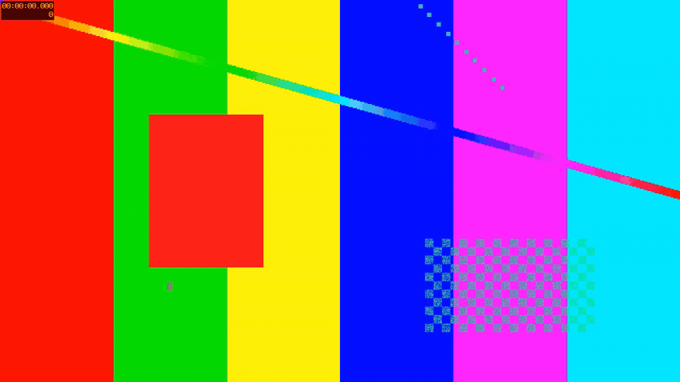
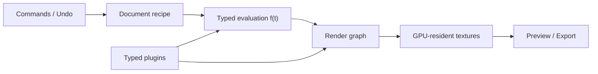

# Motolii

<p align="center">
  
</p>
<p align="center"><em>M1 exit demo — a typed project recipe rendered headlessly to mp4</em></p>

> **After Effects is too heavy. Let's build a lighter motion-graphics compositor in native Rust.**

**GPU-resident rendering. Direct tools instead of setup rituals. Typed plugins. Local projects. One deterministic path from preview to export.**

Motolii is an open, inspectable, plugin-extensible compositor focused on making 3–5 minute music videos. It brings motion graphics, video, procedural shapes, text, effects, and 2.5D/3D assets into one composition with a single-song timeline.

The project does not depend on a new compositing invention. Keyframes, easing, typed parameter links, render graphs, GPU textures, command-based editing, selective caches, 2D/3D projection, and plugins are all known techniques. The work is to compose them into a small, explicit, replaceable system without making historical workarounds part of the product model.

Pre-1.0, under active development. The core is usable from the CLI; the desktop editing experience is the next major layer.

## Why Motolii

After Effects established much of the language of modern motion graphics, but too much ordinary intent still passes through Null rigs, precompositions, expressions, scripts, and paid plugins. Each workaround is usable; together they tax experimentation. Professional power should not require artists to spend attention maintaining technique around the tool.

Cavalry and Autograph demonstrated strong alternatives, but [Cavalry's acquisition by Canva](https://www.canva.com/newsroom/news/mangoai-cavalry-acquisition/) and [Autograph's transition from Left Angle to Maxon](https://www.maxon.net/en/article/autograph-acquisition) also show the limit of a commercial counter: its future is not held by its user community. AviUtl showed how far a local, lightweight, community-extended tool can travel, while its closed, single-author core showed what plugins alone cannot repair.

Motolii's answer is not a novel compositing algorithm. It is a permissively licensed, local, forkable core that collects proven ideas, removes repeated workarounds, and keeps both common operations and advanced meanings explicit. The detailed evidence and design responses live in [`docs/ae-pain-points.md`](docs/ae-pain-points.md) and the [prior-art reviews](docs/reviews/); the README stays focused on the resulting tool.

## Simple is not the same as beginner-only

Professional software often mistakes operational complexity for professional power. Motolii treats every unnecessary decision, setup ritual, hidden controller, and panel round-trip as lost creative attention.

The goal is not to remove advanced control. It is to make common intent direct while keeping the underlying meaning inspectable.

```text
Direct operation ─┐
Named tool        ├─→ typed document meaning
Advanced editor  ─┘
```

A canvas drag, a named tool, and an Advanced control must edit the same document semantics. Moving from the simple path to the advanced path should never require rebuilding the work.

Examples of this direction:

- relative movement as a direct operation, not a Null/expression ritual;
- depth placement as a visible Depth Rail, not repeated Z-field bookkeeping;
- typed Follow/LookAt relationships, not string expressions;
- explicit effect and depth scopes, not invisible adjacency rules;
- interval easing controls, not mandatory graph surgery;
- plugin parameters that always have a host-generated editing fallback.

Complex expression and plugin escape hatches can exist, but repeated user recipes are evidence that the host should learn a smaller, named primitive.

## Known parts, deliberately composed

Motolii learns from After Effects, AviUtl, Cavalry, Autograph, Alight Motion, Nuke, Blender, game engines, DAWs, and many smaller tools.

The useful question is not “which existing application should be cloned?” It is:

> Which proven meaning belongs in the host, which expression belongs in a plugin, and which historical workaround should disappear entirely?

Ideas and public semantics can be studied and recombined. Code, assets, trademarks, and proprietary implementation details remain separate and are not copied.

The resulting system is intentionally conventional at its foundations:

- a serializable document recipe;
- typed values and deterministic evaluation at time `t`;
- a render graph operating on GPU-resident textures;
- one preview/export evaluation path;
- command-based edits with Undo and journaling;
- plugins behind narrow, testable contracts;
- caches that are disposable and never become document truth.

The value is in the composition of these parts, the removal of accidental complexity between them, and placing that composition in a core the community can inspect and change.

## A small core is a long-term capability

Motolii uses Rust, wgpu, WGSL, Slint, and ffmpeg today. Those are implementation choices, not project-file semantics or articles of faith.



The core keeps a few boundaries explicit:

- pixels remain in GPU textures while being processed;
- frame format, color space, alpha, and dimensions are described explicitly;
- color conversion has one owner and one final boundary;
- `render_frame(t, Quality)` is deterministic;
- preview and export use the same evaluation function;
- the document stores recipes, while proxies, analysis, simulation results, and bakes remain replaceable caches;
- vendor- and OS-specific GPU APIs do not enter the plugin contract.

If a better GPU abstraction, rasterizer, cache strategy, or accelerator arrives, it should be possible to replace an implementation layer without redefining what a Motolii project means. Replacement is not assumed to be free—it still requires evidence, migration where necessary, and protected golden tests—but the architecture gives it a bounded place to happen.

This is the internal form of the same simplicity promised to users: fewer hidden meanings, fewer scattered responsibilities, and less knowledge that must be reconstructed before making a change.

## Extensible without becoming fragmented

“Plugin-first” does not mean pushing product responsibility onto plugin authors.

The host owns the meanings that must remain coherent across an entire project:

- time and parameter evaluation;
- coordinates, transforms, camera, and depth policy;
- ownership, references, dependency order, and invalidation;
- effect scope and compositing order;
- commands, Undo, persistence, and migration;
- missing-plugin diagnostics and export strictness;
- preview/export equivalence.

Plugins add expressions inside those boundaries: effects, generators, analyzers, simulations, text systems, materials, and specialized workflows. They do not silently mutate the document, search layers by name, create hidden controllers, or keep undeclared render state.

Repeated community solutions can graduate deliberately:

```text
user plugin / recipe
        ↓ repeated need
validated preset / first-party plugin
        ↓ stable meaning and tests
host primitive / direct tool
```

This lets Motolii grow without turning every workaround into permanent core complexity.

## Open, local, and inspectable

- No account or online license is required.
- Projects and rendering work locally.
- The core is available under permissive MIT/Apache-2.0 terms.
- The project can be forked and continued.
- Design decisions, rejected alternatives, milestone specifications, and implementation guards are documented in the repository.

Open source alone does not make a system understandable. Motolii also aims to make value origins, scopes, dependencies, fallbacks, plugin requirements, and recomputation reasons visible rather than burying them in a black box.

## Scope

Motolii is a motion-graphics compositor focused on music videos.

It is intended to provide:

- keyframes, interval easing, procedural and data-driven parameters;
- raster video and vector shapes in the same composition;
- groups, masks, effects, blending, and non-destructive recipes;
- a shared XYZ world for 2D cards and glTF assets;
- explicit layer-order and depth-occlusion policies;
- one soundtrack, waveform/BPM-oriented editing, and final audio mux;
- extensible effects and generators through typed plugin contracts.

It is not trying to become:

- a general-purpose NLE;
- a color-grading suite;
- a Nuke-style deep VFX compositor;
- a full 3D content-creation package;
- a universal node-programming environment.

Heavy asset creation, character rigging, simulation authoring, grading, and specialist VFX can remain in dedicated tools and arrive as prepared assets or plugins.

## Current status

| Milestone | State | Result |
|---|---|---|
| M0 | Complete | GPU/UI, decode, and rational-time risks measured |
| M1 | Complete and internally frozen | Video → typed animation → GPU composite → mp4 vertical slice |
| M2 | Final integration | Document model, validation, commands/Undo, audio transport/mux, masks, portability |
| M3 | Next | Desktop UI, timeline, direct tools, plugin parameter panels |
| M4 | Planned | Selective cache, proxies, bake integration |
| M5 | Planned | Shared 2D/3D world, depth tools, post-processing, text foundation |

The M1 demo above is generated through the real export path and protected by automated tests. Current milestone truth and task dependencies live under [`docs/specs/`](docs/specs/); this README intentionally stays at project level.

## Architecture and technology

| Layer | Current choice |
|---|---|
| Language | Rust |
| Render core | [wgpu](https://github.com/gfx-rs/wgpu) + WGSL, GPU-resident textures |
| Vector rendering | Vello/usvg boundary |
| UI | [Slint](https://slint.dev), sharing the compositor's wgpu device |
| Decode / encode | ffmpeg sidecar process, raw tagged frames at the boundary |
| Project model | serde data, stable IDs, typed validation, command edits |
| Verification | Rust tests, property tests, semantic and image goldens |
| Structure | Cargo workspace (`crates/motolii-*`) |

See [`docs/performance-model.md`](docs/performance-model.md) for the memory-bandwidth model and [`docs/interaction-simplicity-model.md`](docs/interaction-simplicity-model.md) for how direct, tool, and advanced interactions converge on the same meaning.

## Design and development model

Motolii is specification-driven and verification-heavy so that both human and AI-assisted contributors can work in parallel without inventing incompatible local meanings.

- Each implementation task has an explicit dependency and an automatic completion condition.
- Public boundaries are proved with reference implementations before being frozen.
- Semantic goldens protect meaning; image goldens protect output.
- Document changes require validation, migration analysis, and a single-writer command path.
- Plugins are tested for determinism and GPU-boundary conformance.

Start here:

- [`docs/README.md`](docs/README.md) — reading order and glossary
- [`docs/concept.md`](docs/concept.md) — project definition and decision ledger
- [`docs/interaction-simplicity-model.md`](docs/interaction-simplicity-model.md) — simplicity as user and implementation performance
- [`docs/pitfalls-and-roadmap.md`](docs/pitfalls-and-roadmap.md) — failure catalog and roadmap
- [`docs/specs/`](docs/specs/) — milestone specifications and task contracts
- [`AGENTS.md`](AGENTS.md) — contribution rules for human and AI agents

## Build and run

Requirements:

- the Rust toolchain pinned in `rust-toolchain.toml`;
- `ffmpeg` and `ffprobe` 6 or later;
- Vulkan, Metal, or DX12 graphics support. CI also exercises software Vulkan/lavapipe.

```sh
cargo test --workspace

# Render a project to mp4.
cargo run -p motolii-cli -- export-project path/to/project.json
```

## Contributing

Contributions are welcome in rendering, document semantics, tests, tooling, UI, plugins, documentation, and prior-art review.

Before implementing a task:

1. Read [`docs/README.md`](docs/README.md).
2. Read the relevant milestone specification, including its implementation-guard section.
3. Read [`AGENTS.md`](AGENTS.md).
4. Preserve the protected tests and existing user changes.

Issues and design discussions belong in GitHub Issues. Small, independently verifiable pull requests are preferred.

## About the name

**Motolii** (モトリー) comes from *motley*: a varied, mismatched mixture of different colors, people, or parts forming one whole. The spelling deliberately passes that English word through a Japanese sound, then returns it to Roman letters without resolving cleanly back into either ordinary English or straightforward romanization—the final `lii` is intentional. The name is assembled, slightly crooked, and difficult to classify, like the project itself: known techniques, non-destructive recipes, and specialized plugins recomposed outside the conventions of the tools that produced them.

## License

Licensed under either:

- Apache License 2.0 ([`LICENSE-APACHE`](LICENSE-APACHE)); or
- MIT ([`LICENSE-MIT`](LICENSE-MIT)),

at your option.

Unless explicitly stated otherwise, contributions submitted for inclusion are dual-licensed under the same terms.

Third-party dependencies retain their own licenses. Slint and ffmpeg have separate distribution considerations; see [`docs/references.md`](docs/references.md) and verify applicable terms before release.
