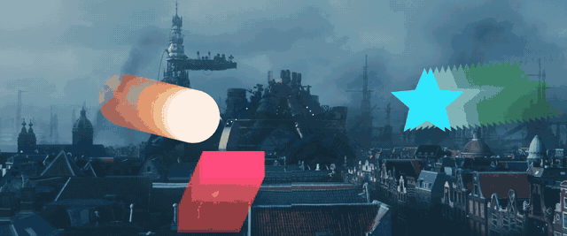

# Motolii

**After Effects の手つきで使える、rerun の上に建てた映像制作ソフト。** 文字・画像・動画・形・立体・点群を同じ舞台に置き、1 本の曲のタイムラインで MV を作るための物です。

<p align="center">
  
</p>
<p align="center"><em>群に残像、その上に「0.2 秒前の背景」— どちらも shader 20 行で書いた効果。スクラブしても同じ絵になる</em></p>

> **After Effects に渡した物は、全部、平らな長方形になる。** 3D スキャンも、点の群も、カメラの道も、音の波形も、合成に入った瞬間に「元が何だったか」を忘れた板に押し潰される。

Motolii は、どちらも起こりかけて起こらなかった **2 つの if** の上に建っています。

**もし合成が、意味を潰さなかったら。** Motolii の舞台は [rerun](https://rerun.io) — ロボットとコンピュータビジョンのために作られた、点群が点群のまま、網が網のまま、線が線のままでいる器です。その上で合成するとは、絵ではなく**意味**を重ねること。だから Motolii では、**1 個の効果を 1 度書けば、動画にも、文字の輪郭にも、網にも、点群にも同じ札のまま乗ります**。乱流で歪ませれば、板の絵ではなくシルエットそのものが曲がる。

**もし AviUtl の文化が、After Effects の文法と出会っていたら。** 20 年、無料でローカルな日本の編集ソフトが、作者の想像を越える形に拡張され、その隙間に MV/MAD の文化が育った。一方で AE の深さは vendor の SDK の奥に封じられ、2 つの島に橋は架からなかった。Motolii はその架からなかった橋です。手が覚えている AE 系の編集の文法と、拡張の自由を憲法として。shader を 1 file 保存すれば棚に並ぶ。Shadertoy を貼ればそのまま動く。時間は効果ではなく host が持つ。

## できること

**編集**: 層、キーフレームと ease、群（子それぞれ / 1 枚に焼いてから、の効果の掛け分け）、トラックマット、クリッピング、2D / 2.5D / 3D のカメラ、文字、形とパス効果（Trim・Pucker & Bloat・Twist・Wiggle・Repeater 等）、押し出しと縁の丸み、音と波形、mp4 書き出し。プレビューと書き出しは同じ 1 本の道を通り、同じ時刻は何度描いても同じ絵です。

**効果**: 棚に並ぶ物はすべて `vism/` の中の file で、保存すれば窓に載ります。

| 書く物 | 乗る先 |
|---|---|
| 場（頂点を動かす: `fn field(in, params) -> offset`） | 動画・画像の板、文字と形の輪郭、網、点群 |
| pass（ISF の fragment shader） | どの素材にも |
| Shadertoy（`mainImage`、または Export の JSON: Buffer A–D + Common） | そのまま |
| 別の時刻を読む効果（自分の層、下の合成、自分の群、comp 全体） | host がその時刻の絵を描いて渡す |
| 前のフレームを保つ効果（`PERSISTENT`: 残像・軌跡・蓄積・反応拡散） | host が履歴を持ち、飛んで来ても辿った物と同じ絵になる |

同梱: Blur、Glow、Bloom、Radiance、Gain、Gradient、Tri LED、Glass、Turbulent Displace、Clip、Background Copy、Background Delay、Set Matte、Time Difference、RGB Trail、Shadertoy から取り込んだ見本 6 本。

## まだのこと

- **macOS だけ**。配布物は無く、自分で build します（下）。他の機械で build するには、描画部（rerun の fork）の参照先をこの機械のパスから直す必要があります
- フリーズフレーム、逆再生の速さ（feedback の効果を逆に辿ると 1 コマごとに辿り直しが走る）、描いたコマの cache
- 効果の重さ: 1080p で残像 1 本なら順再生 60 fps 圏。スクラブで遠くへ飛ぶと 0.1〜2 秒の辿り直しが入る（`docs/plugin-resources.md` §6-5 に実測）
- UI は毎週変わります。スクリーンショットは 1 週間で古くなる

## 効果を書く人へ

`motolii/crates/motolii-render/vism/` に file を置く。3 通り:

```glsl
/*{ "ID": "me.tint", "LABEL": "Tint", "STAGE": "pass",
    "INPUTS": [ { "NAME": "inputImage", "TYPE": "image" },
                { "NAME": "amount", "TYPE": "float", "DEFAULT": 0.5, "MIN": 0.0, "MAX": 1.0 } ] }*/
void main() { vec4 c = IMG_THIS_PIXEL(inputImage); gl_FragColor = mix(c, c.bgra, amount); }
```

- **ISF**（`.fs`）: 上の形。欄は manifest に書けば Inspector に出る
- **Shadertoy**（`.frag`）: `mainImage` をそのまま。`iChannel0` = 自分の層、`iTime` = comp の時刻。Export の JSON（`.json`）なら Buffer A–D と Common も
- **WGSL**（`.wgsl`）: 場（`STAGE: field`）・面（`surface`）・pass

保存した瞬間に窓へ載り、壊れていれば理由が窓の下に出て、前の物が残ります。取説: [場の取説](docs/vism-field-model.md)、[Shadertoy の取り込み](docs/vism-shadertoy-import.md)（向き・時間参照・feedback・複数タブ）、[時間の法](docs/plugin-resources.md)。

## 動かし方（macOS）

Rust、Flutter（macOS desktop）、Xcode の command line tools、FFmpeg（Homebrew）。Flutter は `PATH` か `FLUTTER_BIN`。FFmpeg の場所は `.cargo/config.toml` に書いてあるので自分の機械に合わせる。

```sh
scripts/motolii-ui.sh native       # 初回と、Rust を変えた後
scripts/motolii-ui.sh dev          # 白紙で起動
scripts/motolii-ui.sh dev /absolute/path/project.rrd
```

作品は `.rrd`（rerun の形式）で保存されます。

## 開発に加わる人へ

[docs/README.md](docs/README.md)（設計と裁定の入口）、[CONTRIBUTING.md](CONTRIBUTING.md)、[motolii/AGENTS.md](motolii/AGENTS.md)（一行の憲法）。なぜ作るかの長い版は [MANIFESTO.ja.md](MANIFESTO.ja.md)、要約は [VISION.ja.md](VISION.ja.md)。

## License

[Apache-2.0](LICENSE-APACHE) または [MIT](LICENSE-MIT)。

---

## English

**Motolii is a layer-based video editor with After Effects' grammar, built on [rerun](https://rerun.io).** Text, images, video, shapes, meshes and point clouds share one stage and one song-length timeline.

Two *what ifs*: a compositor that never flattens meaning (a point cloud stays a point cloud, so **one effect written once lands on video, text outlines, meshes and clouds alike** and bends their silhouettes), and the bridge that was never built between AviUtl's extension culture and AE's depth (save a shader file and it is on the shelf; paste a Shadertoy and it runs; the host, not the effect, owns time).

Today: AE-family editing (layers, keyframes, groups, mattes, cameras in 2D/2.5D/3D, text, shapes with path effects, audio, mp4 export), and an effect system where ISF, Shadertoy (single file or exported JSON with Buffer A–D) and WGSL fields reload on save, can read other times (own layer, what is beneath, the group, the comp) and can feed back (`PERSISTENT`) with host-owned history, so scrubbing lands on the same picture as playing. macOS only, no binaries yet, pinned to one machine's paths. Docs in `docs/`; the effect manuals are [field model](docs/vism-field-model.md), [Shadertoy import](docs/vism-shadertoy-import.md) and [the laws of time](docs/plugin-resources.md). Dual-licensed Apache-2.0 / MIT.
