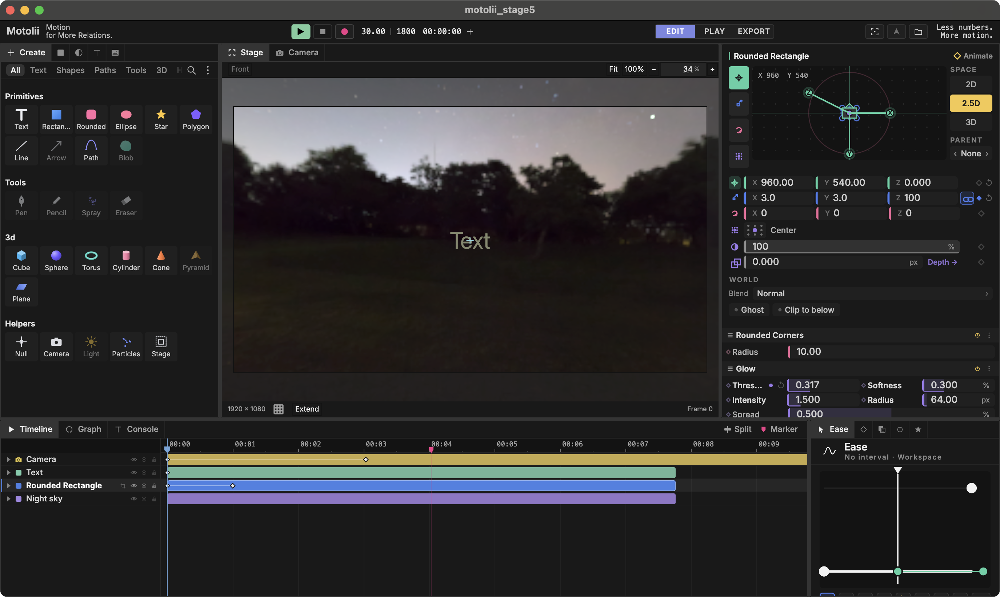

# Motolii

Motolii is an open-source motion-graphics compositor for making music videos: keyframes, interval easing, shapes, text, video, effects and a shared 2D/2.5D/3D stage in one composition, with one soundtrack timeline. The aim is "Rerun turned into After Effects": a compositor whose stage keeps the meaning of what you put on it (a path stays a path, a point cloud stays a point cloud) instead of flattening everything into planar layers.

Pre-1.0, under active development. The desktop editor (macOS) runs and is in daily use by its author; it is not a release and there are no binaries yet.

[日本語: なぜ、もう一つ映像制作ソフトを作るのか](MANIFESTO.ja.md)

<p align="center">
  
</p>

## What it is

- **Direct tools, one meaning.** A canvas drag, a named tool and an advanced control edit the same typed document. Edits are commands with Undo.
- **GPU-resident rendering.** Preview and export evaluate the same deterministic function of time; pixels stay in GPU textures.
- **Small plugin contract.** Effects are "Vism" shaders (WGSL) with typed parameters; the host generates the editing UI, and they reload on save.
- **Local and forkable.** No account; MIT / Apache-2.0.

What exists today and what does not: [docs/wiki/gap.md](docs/wiki/gap.md) and the `pending` list in [docs/product/workspace.json](docs/product/workspace.json).

## Run

macOS only. Install Rust, Flutter with macOS desktop support, Xcode command line tools and FFmpeg. From the repository root:

```sh
scripts/motolii-ui.sh native        # build the Rust host (first run, and after Rust changes)
scripts/motolii-ui.sh dev           # start the editor on an empty project
scripts/motolii-ui.sh dev my.rrd    # open a saved project (or a .js script)
scripts/motolii-ui.sh profile       # release Rust + Dart AOT, to judge real speed
scripts/motolii-ui.sh reload        # hot reload a running `dev` session
```

Rust dependencies are pinned to public GitHub commits; no sibling checkouts are needed. The script finds Homebrew FFmpeg and the active Xcode toolchain, and honors `FFMPEG_DIR` and `LIBCLANG_PATH`.

## Architecture

```text
Flutter UI (motolii/ui/lib)  <--FFI-->  motolii/ui/native (cdylib host)
                                          |-- motolii-edit    commands, Undo, persistence
                                          |-- motolii-doc     document: values, time, evaluation
                                          |-- motolii-render  GPU graph over the Rerun fork's re_renderer
                                          |-- motolii-jobs    export / freeze jobs
                                          `-- motolii-script  JS (QuickJS) author scripts
```

- **Document**: `motolii-doc` holds the saved work and reads it at time `t`; `motolii-edit` is the only writer (Document/Intent, Undo).
- **Renderer**: `motolii-render` compiles the work into a GPU graph on a pinned fork of Rerun's `re_renderer` (wgpu + WGSL); Vism shaders live in `motolii/crates/motolii-render/vism/`.
- **UI**: Flutter presents and sends intents; it keeps no second copy of the work. The Rust side is `motolii/ui/native`, loaded as a dylib.
- **Jobs / script**: export and freeze jobs, and a sandboxed JS host that talks to the editor through commands and read-only queries.

Design detail: [technical boundaries](docs/product/technical-boundaries.md), [module responsibilities](docs/product/modules.md), [frame graph](docs/product/frame-graph.md).

## Development

```sh
scripts/motolii-ui.sh test             # Rust and Flutter suites, lints
scripts/motolii-ui.sh check            # workspace contract (scripts/check-workspace.py)
scripts/motolii-ui.sh check-read-only  # read-side crates build without editing
bash scripts/check-docs.sh             # docs consistency
cargo test -p motolii-doc              # one crate (also -edit -render -jobs -script)
(cd motolii/ui && flutter test)        # Flutter tests
```

Rules for contributors and coding agents: [CONTRIBUTING.md](CONTRIBUTING.md) and [motolii/AGENTS.md](motolii/AGENTS.md). Issues and design discussion go to GitHub Issues; small, verifiable pull requests are preferred.

## Repository map

| Path | What it is |
|---|---|
| `motolii/crates/` | Rust crates: `motolii-doc`, `-edit`, `-render`, `-jobs`, `-script` |
| `motolii/ui/` | the Flutter app (`lib/`, `test/`, `macos/`) and its Rust host `native/` |
| `motolii/ui/lib/` | `main.dart` (the one app entry), `app` (window, top bar, sheets), `workspace` (dock), panels (`stage` `timeline` `inspector` `browser` `desks`; `effects` `colors` `fonts` are Browser shelves), `controls`, `theme` (`metrics.dart` is the one visual-metrics canon), `input`, `session`, `bridge` |
| `plugins/` | example plugin crates |
| `samples/` | sample projects |
| `skills/` | agent skills used by the repository |
| `scripts/` | the dev entry `motolii-ui.sh` and the check scripts |
| `docs/` | concept, product, design, wiki, decisions; start at [docs/README.md](docs/README.md) |
| `semgrep/`, `deny.toml`, `arc-*.toml` | static-analysis and dependency policy |

## Docs

[docs/README.md](docs/README.md) maps where the concept, architecture, run instructions, current status and decisions live. [docs/concept.md](docs/concept.md) is the product definition; [docs/decision-index.md](docs/decision-index.md) finds past decisions by keyword.

## About the name

**Motolii** (モトリー) comes from *motley*: a varied, mismatched mixture forming one whole.

## License

Licensed under either [Apache License 2.0](LICENSE-APACHE) or [MIT](LICENSE-MIT), at your option. Contributions are dual-licensed under the same terms. Third-party dependencies keep their own licenses; Flutter, the Rerun fork and ffmpeg have separate distribution considerations, see [docs/design/references.md](docs/design/references.md).
