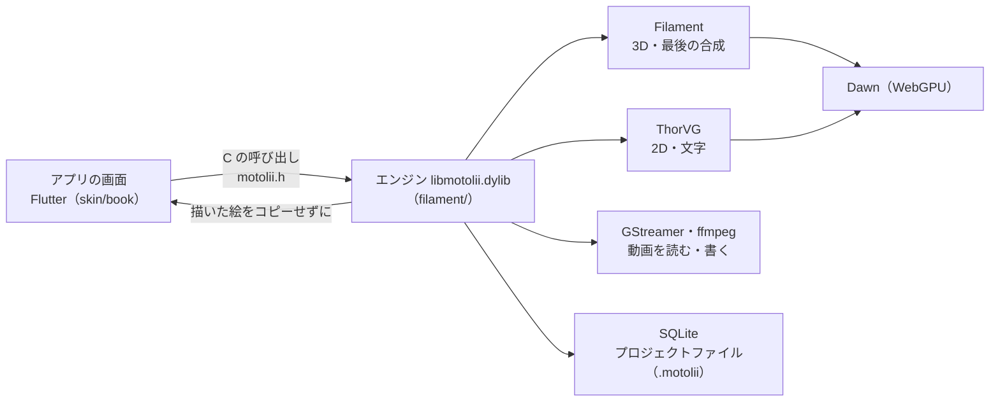

# Motolii

**ネットで見つけたかっこいい表現を、自分の動画にすぐ使う。** 新しい表現のために、開発者の対応を待たない。

Motolii は MV（絵が主役のモーショングラフィックス）を作る、macOS のアプリです。ネットで配られているシェーダーの効果（ISF・WGSL）や AviUtl2 のスクリプトを、**ファイルを置くだけで**自分の動画に掛けられます。2D と 3D を一つの画面の中で扱います。

- **いまの段階**：作っている途中。作者 1 人。このリポジトリは 2026-10-12 に、前の作り [rust_ae](https://github.com/oshikaidesu/rust_ae)（7 月から）の ThorVG と Filament の実験を写して始め、描く仕組みをここで作り直した。画面（Flutter）は別の作業場で作っていた物を持ってきた。配れるアプリはまだ無く、試すにはソースから組みます。
- **いま試すと良い人**：Mac（Apple Silicon）があり、ターミナルでコマンドを貼って組める人。シェーダーの効果や AviUtl2 のスクリプトを動画に使ってみたい人。
- **まだ待つと良い人**：普段の制作にすぐ使いたい人、Windows の人、アプリを入れるだけで使いたい人。

[English](README.en.md) ・ [質問・相談（Discussions）](https://github.com/oshikaidesu/motolii/discussions) ・ [不具合（Issues）](https://github.com/oshikaidesu/motolii/issues)　どちらも日本語・英語のどちらでも。

**この README の言葉**：アプリの画面＝窓、描く仕組み（エンジン）＝中身、レイヤー＝物、コンポジション＝場面（Stage）、プロジェクトファイル（`.motolii`）＝書類、効果やレシピの一覧＝棚。

| Motolii で作った 8 秒（文字・3D・効果） | アプリの画面（その 8 秒を開いた所） |
|---|---|
|  |  |

*左の 8 秒は、レシピ（線の模様）・3D の輪・文字・光（Glow）・RGB のずれを置いて書き出した物。組み立てた後に `docs/examples/mv.sh` の 1 行で同じ物が `~/Movies/Motolii/mv.mp4` にできます。*


*配られている ISF の効果 8 本（CMYK Halftone・Bad TV・Duotone・Edges・Dither-Bayer・Kaleidoscope Tile・Glow-Fast・Pixellate）を、写真（パブリックドメイン）と文字に掛けた所。どれも作者のファイルのまま。*

## 何ができるか（いま）

| できる事 | 使う物 | いまの様子 |
|---|---|---|
| VJ の道具で配られている画面の効果を掛ける | ISF（`.fs`、[ISF-Files](https://github.com/Vidvox/ISF-Files) など） | 効果のフォルダに置けば棚に出る。ISF-Files の 327 本中 318 本が通る（`filament/check/all.sh` で数え直せる）。同梱 115 本 |
| WebGPU のシェーダーの効果を掛ける | WGSL（`.wgsl`、three.js などの画面効果を移した物） | 場面全体に掛かる。同梱 18 本 |
| AviUtl2（日本の動画編集ソフト）の効果を使う | `.anm2`・`.obj2`（中の HLSL を WGSL に変えて動かす） | 同梱 172 パッケージ。10/26 の数えで、当時同梱の 594 本中 372 本が最後まで動いた（[`reports/aviutl2/catalogue.md`](reports/aviutl2/catalogue.md)）。DLL の要る物はまだ |
| 動画・写真・文字・図形・3D のモデル・点群を置く | 動画（GStreamer）、文字と図形（ThorVG）、glTF・`.ply`（Filament） | 動く |
| After Effects のアニメーションを置く | Lottie の `.json`（ThorVG） | 動く |
| 音符を場面の部品にする | MIDI（`.mid`）：ピアノロール、音に合わせて値にキーを打つ | 動く。MIDI の音はまだ鳴らない（動画の音は鳴る） |
| 1 回で絵を作る・物に動きを付ける | 自分のスクリプト（`.js`） | 置けば棚に出る。同梱のレシピ 44 本 |
| ネットの TSL（three.js のシェーダー言語）の表現 | three.js 自身の変換器で WGSL に | WGSL まで。棚にはまだ無い |

ほか：キーフレームとイーズ（anime.js のイーズもそのまま使える）、物理（Jolt）、ガラスの屈折、mp4 への書き出し。何が在ってどこまで確かめたかの全部は、作者の台帳 [`ASSETS.md`](ASSETS.md) にあります。

**速さ**（M4、上の 8 秒の作例、1080×1920）：1 コマ約 4 ms で、毎秒 240 コマでも落ちない。8 秒の書き出しは約 5 秒（ffmpeg の符号化を含む）。

## 他の道具との違い

| | Motolii | After Effects | Cavalry | Alight Motion | Blender | VDMX・TouchDesigner | Motion Canvas・Rive |
|---|---|---|---|---|---|---|---|
| 新しい表現の足し方 | 配られているファイルを置く（ISF・WGSL・AviUtl2・JS） | プラグインを買う・作る | 自分で組む | アプリの更新を待つ | ノードや Python で組む | ISF（VDMX）や GLSL を組む | コードを書く・エディタで作る |
| 主な使い道 | MV の映像を作って書き出す | 映像の合成 | 2D のモーショングラフィックス | スマホで映像 | 3D 全般 | ライブの映像（演奏） | コードで映像（Motion Canvas）、アプリの中のアニメーション（Rive） |
| 2D と 3D | 一つの場面（Filament） | 2D と 3D のレイヤー | 2D が中心 | 2D が中心 | 3D が中心 | 両方（組み方による） | 2D |
| 動く所 | macOS（Apple Silicon）だけ | Windows・macOS | Windows・macOS | iOS・Android | Windows・macOS・Linux | VDMX は macOS、TouchDesigner は Windows・macOS | ブラウザ・各種 |
| 成熟度 | このリポジトリで 2 週間、作者 1 人、リリース無し | 長く使われている | 製品 | 製品 | 長く使われている | 製品 | 使われている |
| 値段・ライセンス | 無料、Apache-2.0 か MIT | 有料 | 有料（無料版あり） | 有料（無料版あり） | 無料、GPL | 有料（無料版あり） | Motion Canvas は無料・MIT、Rive は無料版あり |

**Motolii がまだ負けている所**：出来上がった道具としての安定と機能の数（どれも上の道具が上）、配れるアプリが無い事、Windows で動かない事、ライブで演奏する使い方は考えていない事。

**操作の手本が Alight Motion な訳**：スマホで MV を作る人が慣れている触り方を、まず全部なぞってから、その先へ行くため。手本の操作の表（649 行）のうち、いま同じに動くのは 14%、無いのは 63%（[`reports/overview.md`](reports/overview.md)）。

## 作り


```mermaid
flowchart LR
  W["アプリの画面<br/>Flutter（skin/book）"] -- "C の呼び出し<br/>motolii.h" --> E["エンジン libmotolii.dylib<br/>（filament/）"]
  E --> F["Filament<br/>3D・最後の合成"]
  E --> T["ThorVG<br/>2D・文字"]
  E --> G["GStreamer・ffmpeg<br/>動画を読む・書く"]
  E --> S["SQLite<br/>プロジェクトファイル（.motolii）"]
  F --> D["Dawn（WebGPU）"]
  T --> D
  E -- "描いた絵をコピーせずに" --> W
```

画面は操作だけで、絵はエンジンが描きます。エンジンのフォルダ名が `filament/` なのは歴史的な理由で、Google の Filament そのものではありません（Filament は組み立ての時に取ってきます）。`filament/` の直下には、今の組み立てが使う 63 本と、前の試し（今も自分のスクリプトで動く）が並んでいます。どれが今の物かは [`filament/README.md`](filament/README.md)、作りの全体は [`ARCHITECTURE.md`](ARCHITECTURE.md)。

## いまの状態

- 動く：上の表の「動く」の物、保存（自動）と取り消し、再生（動画の音も鳴る）、mp4 への書き出し、画面のタイムライン・値の欄・棚。
- 一部：AviUtl2 のスクリプト、Alight Motion の操作の写し（上の 14%）。
- 知っている不具合：コピーで作るレシピ（Iris・Weave など）に画面用の効果（`.wgsl`）をレイヤーの効果として掛けると絵が崩れる（場面全体に掛けるのは大丈夫）。
- まだ：Windows、配れる `.app`（エンジンが Homebrew の部品を読むので、作った Mac の外では動かない）、MIDI の音。

## 使ってみる

### 要る物

| 物 | 版・大きさ | 入れ方 |
|---|---|---|
| Mac | Apple Silicon（確かめたのは M4、macOS 15.5） | — |
| Xcode | App Store の Xcode（画面を組むのに要る。Command Line Tools だけでは足りない）。入れると 10 GB を超えることがあり、落とすのに 30 分〜1 時間かかることもある | App Store。入れたら一度開いて追加の部品を入れ、`sudo xcodebuild -license accept` |
| Homebrew | — | [brew.sh](https://brew.sh/ja/) の 1 行 |
| Flutter | 3.47.2（stable）。約 2 GB | 下の「Flutter を入れる」 |
| 空き容量 | Xcode と Flutter のほかに約 10 GB（組み立てた後で 8.1 GB） | — |
| 取ってくる量 | 約 1 GB（Filament のソース 635 MB、Skia 65 MB、Jolt 16 MB ほか。Homebrew の物は別） | — |
| 時間 | Xcode と Flutter を入れる所からなら 1〜2 時間（回線しだい）。それらがあれば初回 約 10 分（M4。Filament 約 5 分、エンジン 約 1〜2 分、画面 約 1〜3 分） | — |

確かめた Homebrew の版：GStreamer 1.28.8、SQLite 3.53.4、LuaJIT 2.1、QuickJS-ng 0.17.0、ffmpeg 9.0、cmake 4.1、ninja 1.13、meson 1.12。

### Flutter を入れる

```bash
git clone --depth 1 --branch 3.47.2 https://github.com/flutter/flutter.git ~/flutter
```

```bash
echo 'export PATH="$HOME/flutter/bin:$PATH"' >> ~/.zprofile && source ~/.zprofile
```

```bash
flutter doctor
```

`Xcode` と `macOS` の行に ✓ が付けば成功（Android や Chrome の行は ✗ でかまいません）。FVM を使う人は `skin/book/.fvmrc` に版が書いてあります。

### 組み立てて開く

ターミナルで 1 つずつ貼ります。2 つ目からは、`motolii` のフォルダの中で（`cd motolii` した後で）走らせます。

```bash
git clone https://github.com/oshikaidesu/motolii.git
```

```bash
cd motolii
```

```bash
brew bundle
```

`Brewfile` の物（GStreamer・SQLite・ffmpeg・cmake など）が入ります。最後に `Homebrew Bundle complete!` と出れば成功。

```bash
filament/dawn_probe/build.sh
```

Filament（WebGPU）を取ってきて組みます（M4 で約 5 分）。最後に `dawn_probe: 4096 triangles …` と数字の行が出れば成功。

```bash
filament/edit.sh build.motolii < /dev/null
```

エンジンを組みます。ThorVG・Skia・libtess2・Jolt などは、ここで初回だけ取ってきます。`edit.sh` はプロジェクトファイルを開いて命令を待つ道具なので、`< /dev/null` で「命令なし」を渡し、組み立てて空のファイルを作ったらすぐ終わらせています。`filament/out/libmotolii.dylib` ができれば成功（`build.motolii` は消してかまいません）。

```bash
skin/book/live.sh
```

画面が開きます。プロジェクトファイルは `~/Movies/Motolii/Untitled.motolii`（自動で保存）、書き出した動画もその隣にできます。画面を閉じると終わります。次からはこの 1 行で開けます。

### 最初の 1 本（画面で）


1. 画面が開いたら、左上のボタンの並びの 5 つ目（四角に ＋、**Create**）を押し、検索に `Iris` と打つ。
2. **Iris** のタイルを押し、下の **Create** を押す。場面に色の輪が置かれ、下のタイムラインに帯が 1 本できる。
   
3. 輪を選んだまま、ボタンの並びの 2 つ目（きらめき、**Effects**）に替えて `Glow` を探し、押して下の **Add** を押す。輪が光り、ボタンが **Remove**（外す）に変わる。
   
4. 右上の **Render** を押すと、書き出しの小窓が出る。名前（例 `first`）を入れて小窓の **Render** を押す。
   
5. プロジェクトの隣に `first.mp4` ができ、上に `Written: first.mp4` と出る。
   

この 5 手は試験としても走ります（`skin/book/integration_test/first_piece_test.dart`。上の絵はこの試験が撮った物）。

### 次に：自分の素材で

- **動画・写真を置く**：左上の 1 つ目（**Media**）で `Home` から自分のフォルダを開き、ファイルを選んで下の **Place**。動画の音は再生中に鳴り、書き出しにも入る。
- **文字を置く**：場面の左の道具の **T** を選んで場面を押すと、文字のレイヤーができる。文字そのものは右の値の欄の文字の箱で変える。書体は左上の 3 つ目のボタン（**Aa**）の棚から。
- **動かす**：右上の値の欄の **Animate all** を入れてから、値（位置・大きさなど）を横に引く。今の時刻にキーが打たれる。時刻を変えてもう一度引くと、その間が動く。動き方は下の **Ease** で選ぶ。
- **保存・開く**：保存は自動（上に `Saved 時刻`）。新しいプロジェクトは メニューの **File › New Document**（⌘N）、同じフォルダの別のプロジェクトは **File › Open**。

### 最初の 1 本（コマンドで）

画面を使わずに、レシピで絵を作り、光（Glow）と場面全体の RGB のずれ（`rgbshift.wgsl`）を掛けて、8 秒の mp4 に書き出す例です。`filament/edit.sh` はプロジェクトファイルを開いて、1 行ずつの命令を受けます（`help` で一覧）。

```bash
filament/edit.sh $HOME/Movies/Motolii/first.motolii <<EOF
make Weave
effect 1 Glow
say 0 script $PWD/filament/effects/rgbshift.wgsl
write $HOME/Movies/Motolii/first.mp4
EOF
```


- `make Weave`：レシピ「Weave」でレイヤー 1 を作る（`recipes` で一覧）。
- `effect 1 Glow`：レイヤー 1 に効果を掛ける（`effects` で一覧）。
- `say 0 script …`：0（場面そのもの）に場面全体の効果を置く。
- `write …`：mp4 に書き出す。

上の 8 秒の作例は `docs/examples/mv.sh`（中の命令は `docs/examples/mv.txt`）。

### 困ったら

| 出た事 | 直し方 |
|---|---|
| `flutter: command not found` | 上の「Flutter を入れる」の 2 行目をもう一度。別の場所なら `FLUTTER=/path/to/flutter skin/book/live.sh` |
| `brew: command not found` | [brew.sh](https://brew.sh/ja/) の 1 行で Homebrew を入れる |
| `xcrun: error` や、Xcode が無いと言われる | App Store で Xcode を入れ、一度開いて追加の部品を入れ、`sudo xcodebuild -license accept` |
| `No space left on device` | 空きを 10 GB 以上にしてから、止まったコマンドをもう一度 |
| `git clone` や `build.sh` がネットの途中で止まった | 同じコマンドをもう一度。直らなければ `filament/third_party/` の中の止まった物のフォルダを消してからもう一度 |
| `ld: library 'webgpu_dawn' not found` | `filament/dawn_probe/build.sh` を先に走らせる |
| 画面は開くが場面が黒い | エンジンを組んだか確かめる（`filament/out/libmotolii.dylib` があるか）。無ければ `filament/edit.sh build.motolii < /dev/null` |

それでも止まったら [Issue](https://github.com/oshikaidesu/motolii/issues) に、走らせたコマンドと出た文をそのまま貼ってください（ひな型があります）。使い方の質問は [Discussions](https://github.com/oshikaidesu/motolii/discussions) へ。日本語・英語のどちらでも。

### 新しくする・消す

- 新しくする：`git pull` の後、`filament/dawn_probe/build.sh` と `filament/edit.sh build.motolii < /dev/null` をもう一度（変わった所だけ組み直す）。画面は `skin/book/live.sh` が組み直す。
- 消す：`motolii` のフォルダを消す（取ってきた物と組んだ物は全部この中）。作ったプロジェクトと動画は `~/Movies/Motolii/` に残ります（別の所に置いた物はそこに）。Flutter は `~/flutter` を消す。`brew bundle` で入れた物は `brew uninstall` で。

## 開発に加わる

[`CONTRIBUTING.md`](CONTRIBUTING.md)（[English](CONTRIBUTING.en.md)）にあります（組み立て、試験の走らせ方、決まり、手を付けやすい所）。行動規範は [`CODE_OF_CONDUCT.md`](CODE_OF_CONDUCT.md)、脆弱性の知らせ方は [`SECURITY.md`](SECURITY.md)。

### 考え方

- **自作は負債。** まず既存の実装を探し、作者のやり方のまま使う。無ければ周りの技術やコミュニティまで探す。
- 他の人の作品はなるべく手を入れずに同梱し、隣に作者のライセンスと出所を置く。手を入れる時は、元に当てる差分（`.patch`）に分けて元は作者の配布元から取ってくるか、ファイルの 1 行目に元と改変を書く。
- 今は自分で書いたコードも多い（画面の Flutter など）。借りられる物が見つかれば、自分のコードを捨てて取り替える。
- コミットごとに、何をどこから借りたか（出典）を書く。

### 並び

| 場所 | 中身 |
|---|---|
| `filament/` | エンジン。入口と、今の組み立てが使うファイルの一覧は [`filament/README.md`](filament/README.md) |
| `filament/effects/`・`recipes/`・`animators/`・`ways/` | 同梱の効果・レシピ・動き・イーズ（利用者のフォルダと同じ形） |
| `filament/aviutl_scripts/` | 同梱の AviUtl2 のスクリプト（作者ごと、LICENSE と SOURCE.txt つき） |
| `filament/check/` | エンジンの試験（`all.sh` でまとめて） |
| `skin/book/` | アプリの画面（Flutter、macOS）。試験は `test/` と `integration_test/` |
| `thorvg/` | ThorVG を wgpu に載せた前の結合（前の試しのスクリプトが使う） |
| `old/` | 前の土台の実験（今の作りからは使っていない） |
| `docs/` | この README の絵と作例（`media/`・`examples/`）、作者の作業メモ（`notes/`） |

### 文書の地図

| 外向け | 作者の作業メモ（日本語、そのまま公開） |
|---|---|
| `README.md`・`README.en.md`・`ARCHITECTURE.md`・`CONTRIBUTING.md`・`CONTRIBUTING.en.md`・`THIRD_PARTY_NOTICES.md`・`filament/README.md` | `ASSETS.md`（在る物の台帳。コミットの見張りが読むので一番上）・`docs/notes/`（やること・採点表）・`reports/`（調べた記録。絵と動画、人の投稿を集めた物は git に入れていない）・`skin/OVERVIEW.md`・`skin/PROCESS.md`（10 月初めの記録） |

## ライセンス

Motolii 自身の物は [Apache License 2.0](LICENSE-APACHE) と [MIT](LICENSE-MIT) のどちらでも、使う人が選べます（ダブルライセンス）。送ってもらった貢献も、特に断りが無ければ同じ二つのライセンスで受けます。同梱した他の人の作品は、それぞれのライセンスに従います（[`THIRD_PARTY_NOTICES.md`](THIRD_PARTY_NOTICES.md)）。

*Licensed under either of [Apache License 2.0](LICENSE-APACHE) or [MIT](LICENSE-MIT), at your option. Unless you explicitly state otherwise, any contribution intentionally submitted for inclusion in the work by you, as defined in the Apache-2.0 license, shall be dual licensed as above, without any additional terms or conditions. Bundled third-party works keep their own licences.*
