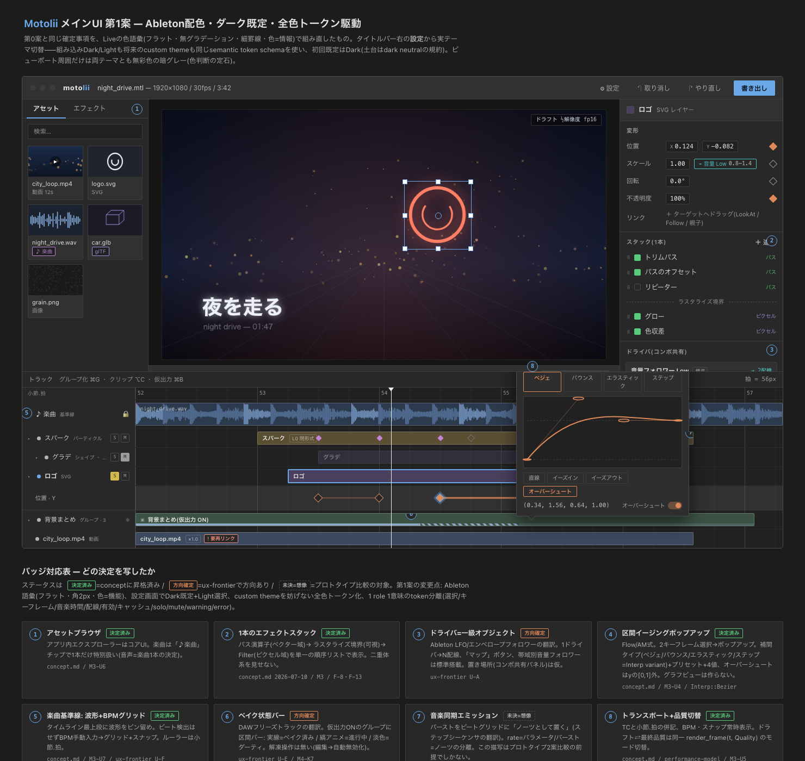
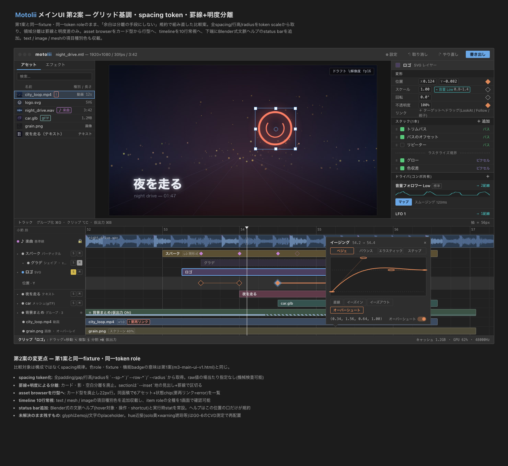
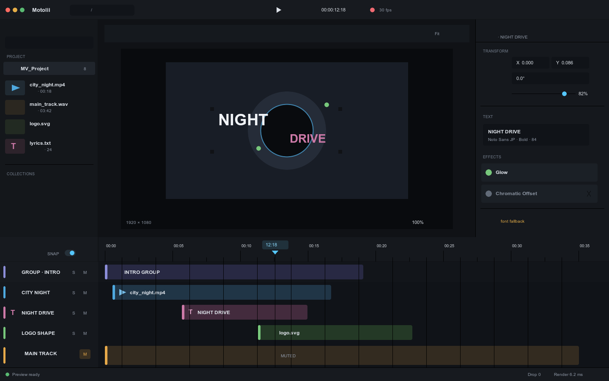
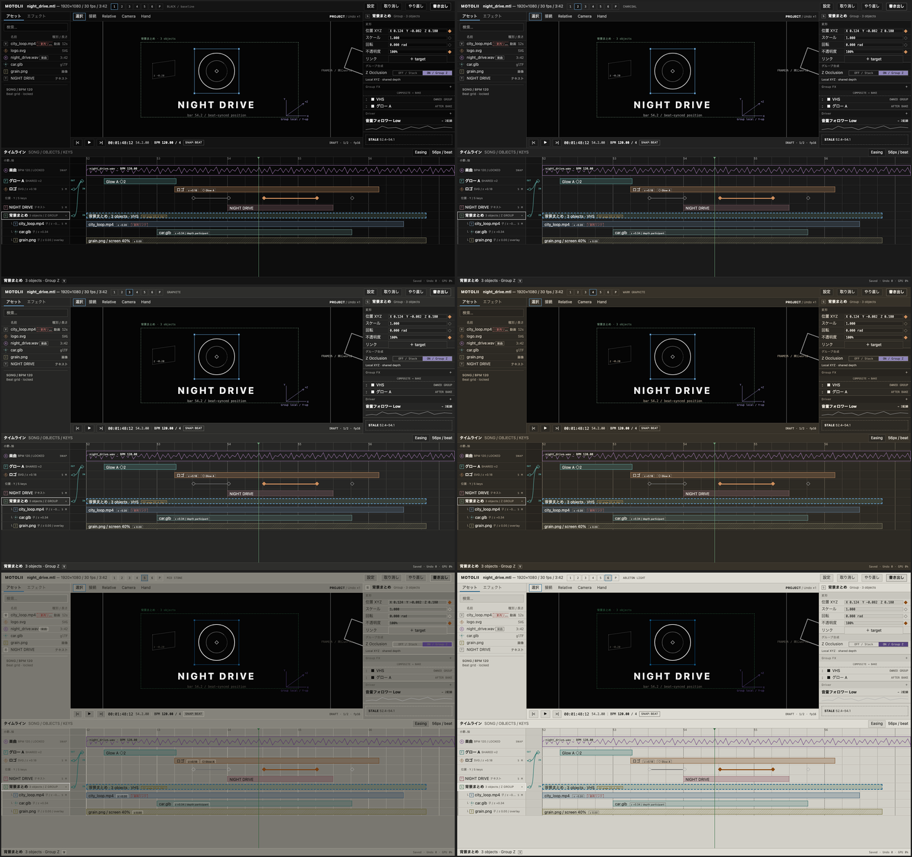

# M3 UIモック

## JSX分解基盤

- [部品台帳と並行所有ルール](../mocks-ui/README.md)
- [機械可読な対応表](../mocks-ui/component-map.json)
- `docs/mocks-ui`は、現行HTMLを`tokens → primitives → patterns → surfaces → screens`へ分解して比較するモック専用基盤である。
- React / JSXのprops、state、DOM event、CSS値、component境界をRust公開API、Document、User settings形式、egui公開component名へ転記しない。
- `#all-surfaces`ほか既存hashは、元HTMLを直接raw importするparser-backed React bridgeで忠実再現する。Browser、Stage、Inspector、Timeline等をnamed wrapperへ昇格し、旧HTMLとの画像比較を保ったまま面単位で置換する。
- 手書きの簡略構成は`#skeleton`へ分離し、視覚正本や製品token判断には使わない。

ローカル実行:

```sh
cd docs/mocks-ui
npm ci
npm run dev -- --host 127.0.0.1
```

`http://127.0.0.1:5173/#all-surfaces`が忠実再現した統合fixture、`#skeleton`が構造だけの簡略版、`#catalog`が登録済みscreen一覧である。部品・状態単位の確認は`npm run storybook`、旧新の自動比較は`npm run test:visual`を使う。

## モック共通規約

- 審判用の入場・状態切替はhash（例: `#all-surfaces`）で行い、製品chromeへ審判用button・注記・fixture名を混ぜない。
- 規則文・思想文・アーキテクチャ公約をUIへ常設しない。説明はhover / focusのInfo、操作中のContext、Developer infoへ時間方向に配分する（[UI操作言語§5.3](../ui-interaction-language.md)）。
- 状態語は逸脱時のみ表示し、正常・不変の既定表示は沈黙とする。同じ事実のBriefは1 surface 1箇所。
- HTML改訂のたびにgoldenをheadless Chromeで再生成し、HTMLと乖離させない。

## Plugin UI / Vism package境界モック（2026-07-17）

- [m3-vism-host-boundary.html](m3-vism-host-boundary.html)
- 一枚審判fixture: [Assets](m3-vism-host-boundary.html#asset-explorer) / [Inbox Empty + Tip](m3-vism-host-boundary.html#inbox-empty) / [Color Book](m3-vism-host-boundary.html#color-book) / [Depth Rail](m3-vism-host-boundary.html#z-rail) / [Easing区間](m3-vism-host-boundary.html#easing-interval) / [全部載せ](m3-vism-host-boundary.html#all-surfaces) / [Settings](m3-vism-host-boundary.html#settings)
- 対象: [Vismコンセプト](../vism-package-concept.md)の「未知の表現を受け止めるHost外殻」を、M3製品コードから隔離して検証する。
- `Plugin Browser / Host標準Inspector / missing recovery`の3面を同じ制作画面へ置き、表現thumbnail・用途Label・由来からの発見、Project instanceとの分離、欠落時payload保持、無関係編集、必要export拒否、Project openとinstallの分離をfixture化する。通常UIは「プラグイン」または配置文脈の「エフェクト」等を使い、`Vism`／`.vism`はDeveloper infoへ下げる。
- Plugin BrowserはProject Explorerと同じ`Search → Sources / Collections → Results`のBrowser shellへ統合する。`All / Installed / Project Used / Missing`はHost source、Favorites等はUser Collection、確定使用履歴はRecent sourceとして役割を分ける。狭いpanelではSearch直下にkind tag/filter行を挟まずResultsへ視線を繋ぎ、Sources / Collectionsと分類責任が重なる`All / FX / Gen / Text`等を常設しない。Collectionはstable package identityを参照する仮想User libraryであり、install先、package内部path、`.vism`のfilesystem階層を反映しない。
- Plugin Resultsの既定は視覚結果を最大面積にした名前付きthumbnail gridとし、必要なら名前行を隠して画像面を増やす`thumbnail-only`とlistへ切り替えられる。thumbnail-onlyは文字を縮小せず、accessible name、focus、tooltip、kind、`MISSING / UNAVAILABLE`を維持する。通常cardはthumbnail、短い名前、kind iconを基本とし、正常な`READY / AVAILABLE`、説明、tag列、由来を反復表示しない。Projectへ追加済みのEffectを操作する時だけ、短い説明と用途をInspectorのEffect parameter領域先頭へ置き、対象Objectとの関係以外のparameter群は同じfocus面へ並べない。Browserへ別Detailを作らず、由来・capability・providerはInfo / Developer infoへ下げる。適用はcardを対象Objectへdrag/dropする操作を基本とし、選択中Objectが有効ならdouble clickまたは`Enter`を同じCommit Intentへ接続する。反復`Apply`ボタンは置かない。view切替とthumbnail寸法は表示だけのUser settingで、Collection、選択、Documentを変えない。
- 基準モックのDepth RailをTimeline直上へ統合し、現在時刻の`Edit-Space Z`をROOT／GROUP別に表示・dragできる。既定は閉じ、譜面headerのDepth iconまたは`#z-rail`で明示的に開く。Timeline本体は固定名列・1項目1横行・Lane所有を持たず、左端の単一`Inbox`と、全barを衝突回避だけでpackingする一枚の時間面から成る。Inboxは未配置素材、未解決review note、未確認background job等の「まだ片付いていないもの」への参照だけを受け取り、選択・hoverへ追従しない。値はInspector、接続はArchitect、操作説明は下端Statusへ分離する。Object bar内の接続要約、readiness区間、操作中parameterのkeyframeは同じ時間面で読む。`Position X/Y`と`Depth Z`のUI分離は2026-07-17改訂で実施済み。
- `#all-surfaces`はHost標準Inspector、Stage、譜面、Depth Railを残したまま、BrowserのProject ExplorerとColor Bookを同時に表示する構造goldenである。Project / Pluginsは同じBrowserの明示tabなので同時表示せず、別画面の寄せ集めを作らない。
- AssetsはProject asset管理と外部filesystem Explorerを別window・popupへ分けない。従来のBrowser内`Project` tab自体をExplorer UIとし、その中で`PROJECT / FILES`を明示切替する。Plugin tabと同じSearch、Sources / Collections、Results、grid/list、keyboard選択、previewの操作文法を使い、file path移動だけをFILES固有のSource操作として追加する。FILESには実directoryへのWorkspace参照であるRegistered Foldersを複数登録でき、各登録フォルダを基準にその配下をbreadcrumbとfolder tileで辿る。登録・解除・最後に開いたpath、検索・preview・選択はDocumentとUndoを変えず、CollectionやProject asset所有へ転写しない。`Add to Inbox`は未配置参照をInboxへ受け取るだけでDocument配置を作らず、PROJECT側の`Place selected`だけが既存Document意味への1 gesture=1 Undoとなる。Inbox、filesystem選択、Project tabの表示状態をDocumentの第二のasset所有者へしない。
- Inboxは異種データを一形式へ混ぜる保存庫ではない。asset、review note、background jobは各正規状態が所有し、Inboxは未整理・未確認状態だけを参照する。配置・解決・確認・dismiss後は一覧から外す。通常操作history、全asset、全note、設定、command launcherは蓄積しない。空の時だけ一件のTipを表示でき、既読/dismissはUser setting、Document・Undo不変とする。
- Abletonの色による再発見を先例に、固定領域へ小面積のwayfinding colorを反復する。Project、Files/Inbox、Plugins、Stage、Inspector、Timelineは見出し先頭の同形markerと選択tab下辺で場所を識別する。Timeline barはカテゴリ色へ固定せず、安定Object IDからpalette slotを決定して単色面を割り当てる。見た目は多様でも再描画ごとの乱数ではなく、同じObjectは同色、同じmp4同士でも別色になる。同種素材が続いても個体を追えることが目的であり、種類はicon・名称・bar形状、選択はoutline、warning/errorは固有icon・線種で読む。任意色を保存するDocument fieldは本モックから追加しない。Inbox内はasset / note / jobのicon形と小面積の種別色を併用する。
- 全体色味はApple Dark Mode / AccessibilityとAdobe Spectrumの暗色UI規約を参照して再調整した。UI土台を純黒寄りから`bg / panel / raised / hover`の明度階層へ持ち上げるが、ベース面はRGB各成分を揃えたneutral grayとし、寒色・暖色どちらの温度も持たせない。作品Stage内の黒は変更しない。TLのObject paletteはOKLCHで近い知覚明度・低いchromaへ揃えた候補をsRGBへ変換し、固色色面には全slot共通の暗色文字を置く。選択は白outline、warning/errorは別tokenと形で示す。これらのhex値はモック候補であり、G0-6のtheme token値を固定しない。
- Color Bookは明示的に開く管理drawerであり、通常の色編集入口はInspectorの`Fill`/`Stroke`に留める。swatchは文字やHEX一覧ではなく色面を主役にし、Folder、複数Label、確定使用だけのHistoryから再発見する。星1〜5は候補ごとの評価入力と反復iconを増やすため撤回した。解決済みColor値だけを既存parameterへコピーし、外部paletteへのlive bindingや独立した色所有者を作らない。
- Color生成は色環と内側fieldで行い、field形状`Triangle / Square`は低頻度なので独立Settingsへ置く。スポイトは独立iconからStage sampling previewへ入り、`Esc`で変更ゼロ。swatch寸法slider（Settings）とdrawer左端dragは別々のUser settingで、px値をDocumentへ流さない。
- Color swatchはsingle clickでPreview、double clickで現在の`Fill`/`Stroke`へCommitする。keyboard `Enter`と明示`Apply`も同じIntentへ接続し、CommitだけをHistoryへ積み1 Undoにする。
- Objectへ適用済みの状態では、右Inspectorを`Selected Object → Transform → Appearance → Applied Plugins → 選択Plugin parameters → Lifecycle`の順にする。plugin単体詳細へ置換せず、何へ適用され、Object全体のどの結果へ作用するかを同じpanelで読む。
- 数値parameterは表示幅が意味上の最大値に見える有限sliderを既定にしない。値面を左右dragするscrubを基本にし、有限端を持たない横目盛が固定cursorの下を流れるdial表現で操作量を返す。release時の短い着地animationは値の意味を運ばず、reduced-motionでは止める。極端値もPreview・Cancel・Undoできるようにする。有限barは型の意味として上下限が確定している値にだけ使い、panel幅や画面比率を値域へ結び付けない。
- automation可能なparameterは名前の直横にdiamond markを置く。accent枠+diamondはAutomation ON、低コントラスト枠+diamondはOFF、現在時刻にkeyがある場合だけdiamondを塗る。文字状態も併記し、色や塗りだけへ依存しない。mark操作とTimelineの現在channel key投影は同じparameter状態へ同期し、切替は1 Undoとする。
- Easingはkey単体ではなく`左key → 右key`の間の動きである。Alight Motion由来の区間中心導線として、Preview直下にGraph iconを置き、playheadが現在channelの隣接key区間の**内部**にある時だけ点灯・操作可能にする。key上、最初のkeyより前、最後のkeyより後では消灯する。key clickは時間位置の選択に留め、Graph Viewを開かない。
- 単色Object bar上のkeyframe diamondは10px、2px dark stroke、1px light outer ringの二重コントラストで表示する。keyなし／keyありは中抜き／暗色塗り、選択中はさらに外側のoutlineで識別し、Object paletteの色相だけへ可視性を依存させない。
- 点灯したiconからEasing Graph Viewを**Timeline右下の固定popup**として開く。入口の対象はplayheadを挟む両端keyから一意に導出し、任意key集合や複数選択をEasingの所有者にしない。curve / preset / handle releaseは現在の1区間への1 command / 1 Undoで、補間は左keyのoutgoing interpolationとして保存する。icon点灯、対象区間の導出、popup開閉はTransientでDocument・Undoへ入れない。
- Easing Graph Viewは対象Object・channelだけをheaderに残し、区間番号、key数、時刻範囲、区間stripを表示しない。key間にいることは点灯した入口とGraph自身で十分に読めるため、区間を別の所有物に見せる重複投影を作らない。細いvalue-time graphの左右余白を操作面にし、左へcurve形状thumbnail、右へBezier handle 1/2のX/Y値を置く。`Linear`等のcurve名と短い説明は常設せず、hover / focusのInfoとaccessible nameへ下げる。Overshootも文字badgeではなく導出iconにする。第二の`Apply`入口、下部の文字button列、raw tupleの重複表示、数値range、軸label、固定titleは置かない。handle dragはPreview、`Esc`は変更ゼロ。
- ユーザーcurve presetは`MY CURVES`棚として[UI操作言語§3.2](../ui-interaction-language.md)の契約で持つ: Folder select・横断Label・確定使用だけのHistoryを備え、curve thumbnailを最大面積の識別物にする（名前は従属）。single click=現在区間へPreview（Document変更ゼロ）、double click / `Enter`=現在区間へ1 command / 1 Undo。`＋ SAVE CURRENT`は現在curveのUser library追加でUndoを作らない。適用は解決済みinterp+4値のコピーであり、preset名へのlive bindingをDocumentへ焼かない。preset本体・Folder・Label・HistoryはUser settings側とする。
- **モック残件 — お気に入りEasing即適用**: built-inとUser curveを通じてお気に入りは1個だけ持ち、Graph View左側の該当curve thumbnailへ小さな◎markを重ねて、どの形が即適用されるかを読む前に識別できるようにする。mark操作はお気に入りをUser settingへ保存するだけでDocument・Undoを変えず、最後に使用したcurveへ黙って追従しない。playheadがkey間にありGraph iconが点灯している時、single clickはGraph Viewを開き、double clickはお気に入りcurveを現在区間へ即適用して1 command / 1 Undoとする。double click判定中にsingle click側のpopupを確定表示せず、key上・区間外では両操作とも無効。お気に入り未設定時は初期既定を仕様で固定し、偶然の履歴先頭を使わない。
- `Echo Bloom / Glyph Current / Fold Field / Ribbon Array`は責任境界を見るための仮想表現であり、plugin kind、package entry、manifest field、provider port、Kit schemaを決定しない。
- recovery drawerはinstall実装ではない。由来、trust、権限、container、署名、transactional install storeが未決であることを画面内にも残し、実行ボタンを提供しない。
- 引き算改訂（2026-07-17）: 審判向けの講義文・規則文を製品chromeから撤去した。Stage常設の説明カード、Inspector常設のLIFECYCLE表とBOUNDARY箇条書き、譜面ヘッダ・棚・Assets・Color Book・Easingの常設説明文、既定statusの長文とkey hintを削除し、同じ内容はhover / focusで一時表示するInfo（`data-info`→status）とDeveloper infoへ降格した。fixture名・審判語をUI文言へ出さない。
- 状態語は逸脱時のみ表示する。正常時のREADY表示（stage readout・SELECTED OBJECT・Applied Plugins）、`EVALUATING · SAME PATH FOR PREVIEW / EXPORT`バナー、`PLUGIN · HOST OWNED LIFECYCLE`・`HOST STANDARD`・`Host evaluated`等の不変ラベルを撤去した。stage badgeはdiscover / blocked / missingの逸脱専用とし、接続の詳細投影はArchitectへ分離する。アーキテクチャ公約はUIバナーではなく設計文書とDeveloper infoが持つ。
- 同じ事実の家を減らした。BPM / SNAPはtransportのみ、Edit-Space Zはrail・bar badge・Inspectorの独立`Depth Z` groupのみ（identity行から削除、z-readoutはdrag中のみ）、Inspectorのobject-path行を削除。`Position X/Y`、`Depth Z`、`Rotation Z`を別control・別automation channelとして表示する。
- 重複入口とfixture用chromeを削除した。Easingの`APPLY TO N KEYS`、toolbarの`ALL`と`ASSETS`（Project Explorerは既存Browserへ統合）、Overshoot toggle（preset名`SMOOTH`と導出`OVERSHOOT` badgeへ分離）。Browserカードの由来行は`DETAIL`表示のみとし、Transform行のautomation markへ`AUTO ON/OFF`の文字状態を併記した。
- Easing panel再整理（同日）: 固定title行、数値range、raw tuple、`VALUE`/`TIME`軸label、`SELECTED INTERVAL`文字を削除した。区間中心導線への改訂後も、時刻範囲・件数・key stripは追加せず、Graph自身へ意味を重ねない。curve名の文字button列とX1..Y2の下段も撤去し、左右余白の形状thumbnailとhandle値へ置換した。
- status / InfoのBriefを「結果+最短原因」へ切り詰めた（同日）: 方針文の尻尾（`Document変更ゼロ。` `〜しません。` `復活させません` 等）を反応文から撤去し、所有の保証はCancel / Hand等の「壊れていないこと自体が結果」の操作にだけ残す。
- M2再締結ゲート中に許可された、製品コード・公開API・永続形式を変更しない構成モックである。egui製品実装やVSM-E0〜E3の着手許可には使わない。

### 過去UI統合台帳

現行モックを「最新の一部分」ではなく全体回帰fixtureにするため、過去案の採用要素を次の面へ統合する。

| 過去案の要素 | 現行での統合先 |
|---|---|
| v1/v2のEasing curve、handle、preset、raw 4値、overshoot + AMの区間中心導線 | Preview直下でkey間だけ点灯するiconから開く完全なEasing Graph View |
| interaction-v0の選択bounds、motion path、Relative HUD | StageのSelect / Relative Move |
| interaction-v0 / dynamics-v1の説明付き接続、valid target、Cancel | StageのConnect trace + typed Link + status |
| v3のCamera / Hand分離 | Command barとStage preview。CameraはDocument、HandはView |
| v3のGroup Z、child composite、Driver波形、Effect stack | Host標準InspectorのGroup Composition / Driver / Applied Plugins |
| v3のbeat ruler、楽曲基準、key区間、前後key移動 | Laneを所有者にしない時間面とTransport |
| preview-firstの選択接続要約、Group/child label、readiness | 接続はArchitect、局所要約とreadinessはpacked bar・bar下辺pattern |
| Asset Explorer / Assets / Color Book / Settings / Plugin Browser | 既存BrowserのProject tab内で`PROJECT / FILES`を切り替えるExplorer UI。Color Bookだけを管理drawerに残す |
| 左下の未使用領域、review note、未配置素材、background job、Tip | 未整理状態だけを受け取るInbox。空時のみTip |

次は統合しない。固定Track/Lane、全parameterの常設展開、Inspectorの複製、共有Effectを独立したDocument所有者にするconnection gutterは、その後の設計決定で撤回済みだからである。常設の講義文・正常時の状態語・同義の重複commit入口・審判用toolbar入口も同様に撤回済みとして扱い、復活させない。必要な意味だけをpacked bar、Inbox、Inspector、Architect、Easing panelへ分配する。

境界golden再生成:

```sh
'/Applications/Google Chrome.app/Contents/MacOS/Google Chrome' \
  --headless=new --disable-gpu --hide-scrollbars \
  --force-device-scale-factor=1 --window-size=1440,900 \
  --screenshot=docs/mocks/m3-vism-host-boundary-z-rail-golden.png \
  'file://'"$PWD/docs/mocks/m3-vism-host-boundary.html#z-rail"

'/Applications/Google Chrome.app/Contents/MacOS/Google Chrome' \
  --headless=new --disable-gpu --hide-scrollbars \
  --force-device-scale-factor=1 --window-size=1440,900 \
  --screenshot=docs/mocks/m3-vism-host-boundary-all-surfaces-golden.png \
  'file://'"$PWD/docs/mocks/m3-vism-host-boundary.html#all-surfaces"

'/Applications/Google Chrome.app/Contents/MacOS/Google Chrome' \
  --headless=new --disable-gpu --hide-scrollbars \
  --force-device-scale-factor=1 --window-size=1440,900 \
  --screenshot=docs/mocks/m3-vism-host-boundary-settings-golden.png \
  'file://'"$PWD/docs/mocks/m3-vism-host-boundary.html#settings"
```

## 小さなコア / plugin責任境界モック（2026-07-17）

- [m3-plugin-boundary-learning.html](m3-plugin-boundary-learning.html)
- 対象: [小さなコアと探索可能な拡張](../extensible-core-model.md)の操作検証。
- 前モックの既知外殻（標準Tool bar、Project / Extensions Browser、Preview中心、選択→Inspector、Document実体の時間投影としてのTimeline）へ、`Authoring Tool / Behavior / Generator / Plugin missing`の責任寿命fixtureを統合する。
- 製品UIでは責任分類を上部navigationにせず、Extensions Browserで`Circle Layout / Audio Response / Ribbon Array`という目的名から選ぶ。`Tool / Live / Recipe / Missing`は色・icon・短い種別表示による従属情報に留める。
- Authoring ToolはPreview / Cancel / 1 Undo / 確定後plugin依存なし、Behaviorは型付き由来・極端値・Fit回収・型不一致、Generatorは標準Inspector fallbackと必要時だけの構造編集、欠落状態はrecipe保持と無関係部分の編集継続をfixture化する。
- 新しいplugin trait、custom UI API、Document schemaの決定ではない。GAP-13と解凍手続き前の実装許可に使わない。

## 基準: 高密度メインUI v1

[インタラクティブHTML](m3-main-ui-v1.html)をM3の視覚構成基盤とする。設定画面からのライト/ダーク切替、preview canvas、波形、driver scopeをブラウザ内で実際に描画する。

このHTMLは2026-07-11にClaude Desktopが一時scratchpadへ生成したモックを、2026-07-14に回収し、テーマ設定要件・role名token・Dark既定・contrast修正を反映したもの。静止画はHTML改訂のたびにheadless Chrome(`#dark` / `#light` hashで固定入場)から再生成し、HTMLと乖離させない。



- [ライト静止画](m3-main-ui-v1-light.png)
- [ダーク静止画](m3-main-ui-v1-dark.png)
- ステータス: **視覚構成の基準モック**。Document意味論や未決機能を確定するものではない
- 色: Ableton Liveを先例にしたflat surface、細罫線、色=機能。装飾gradientなし
- 密度: asset browser、preview、property、effect stack、driver、波形、階層timeline、easing popupを同一画面へ常設
- 説明: 画面内badgeと下部対応表で、確定事項・方向確定・未決の出所を分離

## 比較案: グリッド基調 v2

[m3-main-ui-v2.html](m3-main-ui-v2.html)は、v1と同一fixture・同一token roleのまま「余白は分離の手段にしない」規約(2026-07-14追記)で組み直した比較案。G0-6の構成審判はv1とv2を同じviewport・同じ情報量で比較して行う。



- [v2ダーク静止画](m3-main-ui-v2-dark.png) / [v2ライト静止画](m3-main-ui-v2-light.png)
- 全spacing/行高/radiusを`--sp-*`/`--row-*`/`--radius` tokenから取得し、raw値の場当たり指定を排除(色と同じ機械検査に載る)
- 領域分離は罫線+明度のみ。カード・影・空白分離を廃止(asset browserはカード型→22px行型)
- timeline 10行常視。text / image / meshの項目種別色を追加し、item roleの全種を1画面へ収載
- 下端にBlender式文脈ヘルプのstatus bar(hover対象・操作・shortcut・実行時stat)を常設

## 基盤として固定するもの

- 3-pane + 高密度timelineの大区画
- 波形とBPM gridを含むtimeline overview
- property / effect stack / driverを一覧できる右panel
- 選択、keyframe、data mapping、bakeを別の意味色で示すこと
- context説明を右下/status領域へ追加できる構造。Blenderは文脈ヘルプだけの参考で、全体UIは模倣しない
- ライト/ダーク/custom themeとも同じsemantic token schemaを参照すること
- 設定画面で組み込みDark/Lightを選択でき、初回既定はDarkであること(土台dark neutralの規約)
- tokenはrole名のみとし、文字用途の意味色はcontrast 4.5:1以上を保つこと(具体hex値は固定しない)

## 固定しないもの

- HTML内の具体色値、panel寸法、icon、font(現在のglyphはemoji/文字のplaceholderで、icon仕様の先取りではない)
- 既知のhue近接(solo黄とwarning琥珀、domain-path緑とstate-active緑、domain-pixel紫とitem-mesh紫、accentと選択青)。roleは分離済みで、hueの再配置はG0-6のCVD測定で決める
- 組み込み2テーマ以外の配布テーマ内容。custom themeを追加できる契約だけを固定する
- 未決と表示された音楽同期emission等の機能意味論
- plugin custom UI、3D gizmo、任意track色の永続化
- HTML/CSS/Canvasという実装方式。製品UIはM3仕様どおりegui shell + wgpu preview/timelineを使う

## 次の改訂

1. ~~右下/status領域へ短いcontext説明を追加する~~ → v2のstatus barで収載済み（Blenderはこの機能だけの参考）
2. ~~timelineをさらに高くした比較案を同じfixtureで作る~~ → v2で作成済み。G0-6でv1/v2を同一viewport比較する
3. light/dark、grayscale、CVD、125/150/200% scaleで所在認知を比較する
4. hover/focus/drag/trim/easingを操作できるprototypeへ進める

---

# 過去・比較モックの台帳

## timeline v0



- [SVG source](m3-timeline-v0.svg)
- ステータス: **比較用の静的モック**。G0-6のtoken決定、製品UI、goldenではない
- 対象: asset browser、preview、inspector、一般的なtrack型timelineを同一画面へ置いた時の密度と視覚認知
- 表現済み: video/audio/shape/text/group、選択、keyframe、mute、warning、playhead
- 未表現: hover/focus、drag/trim、zoom、easing popup、keyboard操作、IME、reduce motion、別monitor/DPI

色値はこのSVG内だけの仮値であり、DTCG tokenへ転記しない。採択するのは値ではなく、同じfixtureで比較して合格した役割と階層だけとする。

## このモックで答える問い

1. labelを読まず、項目種別・選択項目・mute・keyframe・warningを識別できるか
2. timelineが主作業面として十分な高さと一覧性を持つか
3. preview/inspector/asset browserがtimelineより強く見えすぎないか
4. 意味色が多すぎず、AE型の文字依存へも戻っていないか
5. 新規componentだけが別製品のように浮いていないか

## interaction v0(状態step送り)

- [HTML mock](m3-interaction-v0.html)(ローカルでブラウザ表示。例: `python3 -m http.server --directory docs/mocks`)
- ステータス: **比較用の状態モック**。token決定、製品UI、goldenではない
- 対象: timeline v0が未表現とした操作状態を、autoplayアニメーションではなく**scene切替(motion 0)**で表現する。各sceneはそのまま静止fixtureとしてG0-6のgrayscale/CVD/5秒審判に転用できる
- scene構成: 平常時 / hover・Info / keyboard focus / drag・trim中HUD / Relative drag(HUD+motion path ghost) / easing popup(区間選択→popup) / 接続valid(カーソル追従説明+仮線+輪郭◇) / 接続invalid(型付き拒否理由) / disabled+段階診断(Brief→Context)
- 未表現: zoom、IME、DPI/別monitor、Stage側の全scene、Effect共有のconnection gutter(G0-6画面5)

アニメーションを主表現にしない理由: 視覚言語は「motionを0にしても状態変化が判別できること」を合格条件とするため、動きが説明の主役になるモックは審判手段として使えない。順序が意味を持つ操作(Discover→Target→Preview→Commit)はstep送りで表現する。

## 次の比較案

- v0-A: 現在案。previewとtimelineをほぼ同格
- v0-B: timelineをさらに高くし、previewを縮小
- v0-C: inspectorを必要時だけ展開し、timelineの横幅を増やす

同じfixtureとviewportでA/B/Cを比較し、印象だけでpanel比率を決めない。

## UI dynamics v1（力学検証）

- [HTML mock](m3-ui-dynamics-v1.html)（ローカルでブラウザ表示。例: `python3 -m http.server --directory docs/mocks`）
- ステータス: **UI力学の比較用モック**。既存のinteraction v0を改版したものではなく、2026-07-16時点のUI操作言語から別に構成した。token決定、製品UI、goldenではない
- 対象: 選択のStage/Timeline/Inspector同期、説明付き接続、Relative Move、Camera/Handの所有差、共有Effectの常時接続線、Brief/Context/Inspectの段階診断
- 共通状態: `Discover → Target → Preview → Commit / Cancel → Inspect → Undo`
- 操作: 上部で力学を選び、「次へ」で状態を送る。「自動」は状態間の連続性を見る補助であり、各状態は停止して単独でも読める。`Motion 0`で動きを無効化できる

### このモックで答える問い

1. 操作の途中で、対象・期待型・確定結果・Cancel時の不変条件を同じ画面から説明できるか
2. Commit後も、選択、semantic badge、connection gutter、Inspectorに因果が残るか
3. Camera操作とHand/Stage View操作のうち、どちらがDocumentとUndoを変えるかを動き以外でも識別できるか
4. Relative Moveが通常dragと異なり、現在値ではなくmotion path全体へ作用することをHUDとghostから識別できるか
5. invalid/disabledを色やdimだけで終えず、expected/actualと次の一手へ段階的に到達できるか
6. motionを0にしても上記が成立し、自動再生を止めた任意の状態をreference fixtureとして比較できるか

このモックのanimationは装飾ではない。対象・preview・commit結果の空間的連続性を観察するためにだけ使い、意味の唯一の手掛かりにはしない。

### 再判定（2026-07-16）

`m3-ui-dynamics-v1.html`は状態機械を独立したシナリオ列として前面へ出し、楽曲基準線・高密度メイン画面・評価順より「力学のデモ」を主役にしたため、最新mainの[UIコンセプト](../ui-concept.md)を十分に投影していない。背景色と意味色の仮値も構造判断より先に視線を奪う。以後は**不採用比較案**とし、次のmonochrome構造試験を新しい比較入口にする。

## 高密度メインUI v3 — monochrome構造試験

- [monochrome表示](m3-main-ui-v3-monochrome.html) / [semantic color表示](m3-main-ui-v3-monochrome.html#color)（同じHTML・同じfixture）
- [M3構造golden PNG](m3-main-ui-v3-monochrome-golden.png)（1440×900 / device scale 1）
- [semantic color比較PNG](m3-main-ui-v3-semantic-color-golden.png)（1440×900 / device scale 1）
- ステータス: **M3構造golden**。製品テーマとG0-6の具体token値を固定する色goldenではなく、同一fixtureの区画・密度・因果・Z/Group意味を固定する基準画像
- UI色を黒〜無彩色へ限定し、種別・選択・接続・警告を位置、形、線種、pattern、明度で区別する。意味色が無い状態でも構造が成立するかを先に見る
- v2の3-pane、高密度timeline、右Inspector、status barを維持し、[UIコンセプト](../ui-concept.md)の「楽曲が背骨」をTimeline最上段のロックされた波形+BPMグリッドとして中心へ置く
- 選択、説明付き接続、Relative Move、Camera/Hand、区間イージングは専用デモ画面へ分離せず、同じ制作画面の実操作として組み込む
- animationはPlay時のplayheadと作品評価だけ。UI componentの装飾animationは使わない
- Groupを再帰項目として展開し、子のXYZ、`Z Occlusion: OFF / Layer Order`と`ON / Group Depth`、子合成直後の仮出力点、Group stackの順を同じ画面へ収載する。Groupは固定canvas・固定尺を持たない。次回改訂ではXYZ表示を`Position X/Y`と`Depth Z`へ分ける

### semantic color比較

色は画面を飾るためではなく、Ableton Liveを先例に**種類・機能・状態を一覧から速く拾うため**にだけ使う。surfaceは黒〜無彩色のまま変えず、asset/clip種別、selection、keyframe、Effect接続、Z depth、playhead、warning/errorへ限定して着色する。色を外しても形・線種・label・patternで同じ意味を判別できることを前提とする。

Timeline左端のconnection gutterは、共有`Effect Definition`の◇ `OUT`から各Layer/Groupの○ `IN`へ向かう参照を常時表示する領域である。曲線自体は評価経路ではなく共有元を示し、評価順は隣の`child composite → bake point → Group stack order`で別に読む。

### surface tone比較（同一UI・6段階）

「dark neutral」が「ほぼ黒一色」へ寄りすぎていないかを分離して見るため、構造・fixture・semantic colorを固定し、UI surfaceの明度と色温度だけを6段階へ写像する。StageとOutput Frame内の作品背景は全案で黒のまま固定し、UIを明るくすることと映像の黒を変えることを混同しない。



1. [BLACK / baseline](m3-main-ui-v3-monochrome.html#tone-1) — 現行の黒基調。比較原点
2. [CHARCOAL](m3-main-ui-v3-monochrome.html#tone-2) — 黒を残しつつpanel境界を持ち上げる
3. [GRAPHITE](m3-main-ui-v3-monochrome.html#tone-3) — 中立グレー。高密度のまま行と領域を分ける
4. [WARM GRAPHITE](m3-main-ui-v3-monochrome.html#tone-4) — 暖色寄りの作業面。装飾色ではなくsurface温度だけを変える
5. [MID STONE](m3-main-ui-v3-monochrome.html#tone-5) — 明暗の中間。dark/light二択にしない比較点
6. [ABLETON LIGHT](m3-main-ui-v3-monochrome.html#tone-6) — 明るいneutral surfaceと黒いStageを分離する

各案の1440×900画像: [1](m3-main-ui-v3-tone-1-golden.png) / [2](m3-main-ui-v3-tone-2-golden.png) / [3](m3-main-ui-v3-tone-3-golden.png) / [4](m3-main-ui-v3-tone-4-golden.png) / [5](m3-main-ui-v3-tone-5-golden.png) / [6](m3-main-ui-v3-tone-6-golden.png)

### preview-first語彙試験

- [インタラクティブ表示](m3-main-ui-v3-monochrome.html#preview-first) / [1440×900 PNG](m3-main-ui-v3-preview-first-golden.png)
- Stageを主面積へ拡大し、常設の説明文、規則の文章、既定statusの長文を外す。説明は接続・invalid・drag等、現在操作している時だけContextとして出す
- 空間に存在するものを`Object`、時間上の配置を`Clip`、再帰単位を`Group`として表示し、`Layer`を画面語彙から外す。順序が結果へ影響する箇所だけ`Stack`を使う
- これはDocument型や公開契約の改名ではなく、G0-6で「AE由来の語彙を読ませずに対象を識別できるか」を比較するためのモック仮説
- Group、Z、共有Effect、Driver、key/easing、bake状態は消さず、文章ではなく配置・形・短い状態へ縮約する
- Effectの`IN → FX chain → OUT`は各Object/GroupのTimeline行へ直接統合する。独立Effect Definition行、connection gutter、Inspector内の重複FX一覧はpreview-first表示から外し、共有Effectは同じ`Glow A ◇2`識別子で示す

### Depth Rail試験

- Stage内の小さなXYZ説明図を外し、Timeline直上へ線形な`Depth`数直線を置く。CanvasとTimelineの間で現在時刻の`Edit-Space Z`評価を比較し、再生・seekに追従するmarkerをその場でdragする
- Depth Railは明示的なicon操作で開閉し、選択変更だけでは自動展開しない。開閉はWorkspace-sessionまたはTransientでDocument・Undoへ入れない
- Inspectorは`Position X/Y`と`Depth Z`を別groupへ投影する。これはUIの意味分離であり、Documentの正準XYZ、`position.z`、既存commandを分裂させない。Depth操作だけで別の3D modeへ移行せず、`Depth Z`（平行移動）と`Rotation Z`（Z軸まわりの回転）は別control・別automation channelとして示す
- root ObjectとGroup childrenを数直線内の別段に置く。この段は設定所有者ではなく、同じ正準XYZ世界にある値をparent空間ごとに読み違えないための表示区分である
- markerへpointer・focusを向けた時だけstatusへ現在値と`Drag`を出す。pointer down〜upはlive preview、確定はD2 macro 1回、`Esc`/pointer cancelは変更ゼロとする
- Depth automationが有効なmarkerのdragは現在時刻のkeyを更新し、keyが無い時刻ではrelease時にkeyを追加する。automation無効の静的Depthをdragしただけではautomationを暗黙に開始しない。keyの時間配置とEasingは時間面で扱い、railへ第二の小型Timelineを作らない
- railは`Edit-Space Z`だけを編集する。Cameraはroot world上の文脈markerとして異なる形で表示できるが、Cameraから見た前後は将来の`Camera Depth rank` badgeとして分離し、camera-space depthを同じ数直線へ偽装しない
- Particleは個体ごとのmarkerを作らず、Emitter／生成元の安定IDだけを選択・keying対象にする。必要なら生成群の現在時刻のDepth範囲をread-only帯として導出し、個体編集はMaterialize後の通常Objectへ限定する
- 線形範囲`−0.50…+0.50`を固定して表示し、値が動いても物差しを自動fitしない。`FIT`はユーザー操作として別に置く

### Keyframe overview試験

- preview-firstの譜面は1項目1横行、固定名列、横行固有のS/M・設定入口を持たない。全barを一枚の時間面へpackingし、縦位置は衝突回避の表示結果に限定する。barの移動・再packingでDocument上の所有者や評価順を変えない
- Group本体barには`GROUP · 名前`、Group child barには`↳ 親Group名`を短く添える。これは[譜面UI構成モデル](../ui-score-model.md)に定めるDocument関係の局所投影であり、固定名列、専用横行、縦帯、独立`Lane`を復活させない
- 選択導線はbar直接選択、Depth Rail、明示検索に分け、左端Inboxを項目一覧や横行headerへ転用しない。Inboxは未配置素材・未解決note・未確認jobだけを参照し、選択・hoverへ追従しない。bar/searchのclick・keyboard移動は同じ安定IDをStage/譜面/Inspectorへ投影するだけでDocument・Undoを変えず、値・enable・Effect parameter等の設定入口も追加しない。keyframe clickは時間選択に留め、Easingはkey間で点灯するPreview下のGraph iconから開く
- bar下辺にはprovider snapshot由来の`ready / rendering / stale / unavailable`を時間区間patternとして置ける。これはreadinessの投影であり、cache/bake policyやDocumentを変更するcontrolにしない
- 通常状態では独立parameter行を常設せず、Inspectorで現在操作しているchannelのkeyだけを対応Object/Clipバー上へ重ねる。Position YからOpacityへ操作対象を変えると、同じ場所でmarker集合とchannel badgeが切り替わる
- Preview下のGraph iconは、playheadが同一channelの隣接key間にある時だけ点灯する。key上・区間外では消灯し、key clickだけではGraph Viewを開かない。独立した`Lane`や常設`キー詳細`という所有者を作らず、automation可能な全parameterを展開しない
- Easing Graph Viewが扱うのはplayheadを挟む1区間の補間意図だけ。値、enable、Effect等の設定はInspectorに留め、同じ設定をTimeline側へ複製しない
- 閉じたoverviewと開いたGraph Viewは同じkeyframe正本から区間を導出し、複製された編集状態を持たない。icon点灯とpanel開閉はWorkspace/Transient、Easing適用だけがDocument commandとなる
- markerの存在、選択区間、channel識別はdiamond・位置・badgeで成立させ、色だけへ依存しない

### Asset Explorer試験

- [Explorerを開く](m3-main-ui-v3-monochrome.html#asset-explorer) / [1440×900 PNG](m3-main-ui-v3-asset-explorer-golden.png)
- 左のProject内アセット一覧とは分け、ファイルシステムを視覚的に探す時だけStage上へ一時的なdrawerとして開く。StageとTimelineを全画面置換せず、drag/drop先を同時に残す
- folder preview、thumbnail grid/list、subfolder検索、Labels、Collections、動画hover preview、音声waveform preview、素材内In/OutをExplorerの責務とする
- `Drag → Stage / TL`または`Enter`で初めてProjectへimport+配置する。Explorerでの選択、hover preview、検索、Labels/Collections、素材内In/OutはDocument・Undoへ入れない
- Collectionsを第二のProject正本にしない。ファイル参照と整理はUser settings / workspace候補、配置確定後のAsset/ClipだけをDocumentへ投影する

### User Color Book / Palette試験

- [Color UIを試す](m3-main-ui-v3-monochrome.html#color-palette) / [Stroke popup fixture](m3-main-ui-v3-monochrome.html#color-palette-stroke) / [1440×900 PNG](m3-main-ui-v3-color-palette-golden.png)
- 候補が増える選択棚は[UI操作言語§3.2](../ui-interaction-language.md#32-ユーザーが候補を選ぶ棚)に従い、Folder、横断Label、確定使用だけのHistoryを必須にする。星1〜5は採用しない。色は大きな色面を主役にし、名前・HEX・import形式を常時読むことを選択条件にしない
- 色を新しく作る入口として色環+内側fieldを持ち、fieldの`Triangle / Square`は独立Settingsで切り替える。スポイトは独立icon、swatch寸法とColor Book幅は独立した可変設定とする。これらのpreview・表示設定はDocument・Undoへ入れず、double click／Enter／`Apply`だけを既存Color parameterへの1 Undoにする
- 起動時にpopupや操作説明を先回りして出さない。ユーザーが`Fill`/`Stroke`の色面へpointer・focusを向けた時だけstatusへ短い可能動作を出し、クリック後に初めて色候補と取消方法を見せる。これは情報量の単純な削減ではなく、能動的な意図の直後へ情報を遅延する試験である
- 独立Palette panelを置かない。Inspectorの`Fill`と`Stroke`を別々のColor parameterとして置き、各色面の左クリックで同じ色だけのpopupを開く。縁色は`Stroke`から変更し、現在の編集対象はInspectorの行とstatusで識別する。通常操作でcolor code、token名、import形式を読ませない
- 正規力学は`swatch左クリック → popup → hoverでStage preview → 左クリックでCommit / Esc・外側clickでCancel`。hoverはTransient、Commitだけが既存Color parameterへのD2 command、1 gesture=1 Undo
- 複数Object選択の色編集は本案へ含めない。同色、混在色、一部`Stroke`なし、選択範囲と適用範囲、1 Undoの境界を別fixtureで決めるまで、単一`Colors`への集約や一括置換を正規力学として採択しない
- `Position X/Y`を平面配置の入力block、`Depth Z`を前後配置の独立groupにする。`Depth Z`を`Rotation Z`と同じ入力blockやautomation channelへまとめない
- popupは色面、選択outline、palette-setの小さな色見本だけで識別する。読み込みと管理は`⇩`/`…`から別段階へ進み、制作中の色選択へ管理UIを混ぜない
- import内部の最初の候補はHEX/RGB(A)/HSL(A)貼り付け、CSS variables、DTCG JSON、Figma Variables JSONのColor collection/mode。Figma REST直結はEnterprise条件へ依存するため必須導線にしない
- FigmaのRGBA 0–1とdocument color profileを読み、profile不明を黙ってsRGBにしない。M2の既存意味であるstraight-alpha・非線形sRGB・0–1へ変換できた値だけを受理し、wide-gamutからのgamut lossは診断する
- v1案ではswatch適用時に解決済みColor値を既存parameterへコピーする。palette名、Figma variable ID/alias、外部fileへのlive bindingをDocumentへ追加せず、palette変更で既存作品を黙って変えない
- palette本体、Folder、Label、最近使った色はUser settings / workspace候補。Projectへpaletteを同梱する必要性と寿命はGR-UI-1/GR-PVで意味を決めるまで恒久形式を焼かない

golden再生成:

```sh
'/Applications/Google Chrome.app/Contents/MacOS/Google Chrome' \
  --headless=new --disable-gpu --hide-scrollbars \
  --force-device-scale-factor=1 --window-size=1440,900 \
  --screenshot=docs/mocks/m3-main-ui-v3-monochrome-golden.png \
  file://"$PWD/docs/mocks/m3-main-ui-v3-monochrome.html"

'/Applications/Google Chrome.app/Contents/MacOS/Google Chrome' \
  --headless=new --disable-gpu --hide-scrollbars \
  --force-device-scale-factor=1 --window-size=1440,900 \
  --screenshot=docs/mocks/m3-main-ui-v3-semantic-color-golden.png \
  'file://'"$PWD/docs/mocks/m3-main-ui-v3-monochrome.html#color"

for n in 1 2 3 4 5 6; do
  '/Applications/Google Chrome.app/Contents/MacOS/Google Chrome' \
    --headless=new --disable-gpu --hide-scrollbars \
    --force-device-scale-factor=1 --window-size=1440,900 \
    --screenshot="docs/mocks/m3-main-ui-v3-tone-${n}-golden.png" \
    "file://$PWD/docs/mocks/m3-main-ui-v3-monochrome.html#tone-${n}"
done
```

### このモックで答える問い

1. 色を全て外しても、楽曲基準線、clip種別、selection、keyframe区間、Effect接続、stale/errorを追えるか
2. 初見で左=素材、中央=Stage、右=選択の意味、下=楽曲を背骨にした譜面と推測できるか
3. 操作中だけでなく確定後も、Inspector badgeとTimeline connection gutterからscope・由来・評価順を追えるか
4. CameraとHandのどちらがDocument/Undoを変えるか、色や画面遷移なしで説明できるか
5. Space再生時に動くものが作品とplayheadだけで、UI演出が制作内容より前へ出ていないか
6. 密度を落とさず、disabled/errorの理由と次の一手へstatus/Inspectorから到達できるか
7. 2D objectも同じXYZ worldにあり、Z値とGroup内の遮蔽方式をTimeline・Stage・Inspectorの3箇所から同じ意味として追えるか
8. Groupが「別タイムライン」ではなく同じ譜面上の再帰項目で、子合成→仮出力→Group Effectの順を読み違えないか

## 高密度メインUI v4 — 生成境界の1画面収載

- [monochrome表示](m3-main-ui-v4-generative.html) / [semantic color表示](m3-main-ui-v4-generative.html#color)（同じHTML・同じfixture）
- [構造golden PNG](m3-main-ui-v4-generative-golden.png)（1440×900 / device scale 1）
- [semantic color比較PNG](m3-main-ui-v4-generative-color-golden.png)（1440×900 / device scale 1）
- ステータス: **生成境界の構造golden候補**。v3の区画・token・monochrome先行規約を維持したまま、[generative-user-boundary.md](../generative-user-boundary.md)の5経路(A Materialize / B Pure Live / C Temporal Window / D Bake / E External)を専用デモ画面へ分離せず、同じ制作画面の実物として1枚へ収載する
- 「全機能が一覧で確認できる」高密度方針は、golden審判とも整合する: 1枚のPNG差分で楽曲基準線・5経路badge・seed・preflight・bake進捗/dirty/checkpoint・診断区分を同時に人間審判でき、機能ごとの画面遷移スクリーンショットを廃せる。人のチェックが最大コストである現段階の審判時間をここで削る
- Timelineへ経路の実物を1行ずつ並べる: Materialize済みGroup(seed badge・子は手編集可能な通常Shape)、Live `f(t)` overlay(入力宣言badge)、Temporal Window(−8f宣言のみの予約行)、Simulation Bake(進捗・dirty斜線・▲checkpoint)、External素材(glTF/動画)
- 右Inspectorは同文書§7の制作体験を実物化する: 実行前に入力・seed・出力個数・経路区分が見える生成レシピ、Liveの由来と現在時刻評価値(Advanced)、Bakeの進捗・dirty・推定コスト・取消、SVG importの採用/拒否を型付き診断(Materialize可能 / Feedbackが必要 / 禁止能力)で示す
- 経路の切替はsegmentedにあるが自動昇格しない。status barが常に「診断は自動・確定は明示操作」を説明する

golden再生成:

```sh
'/Applications/Google Chrome.app/Contents/MacOS/Google Chrome' \
  --headless=new --disable-gpu --hide-scrollbars \
  --force-device-scale-factor=1 --window-size=1440,900 \
  --screenshot=docs/mocks/m3-main-ui-v4-generative-golden.png \
  file://"$PWD/docs/mocks/m3-main-ui-v4-generative.html"

'/Applications/Google Chrome.app/Contents/MacOS/Google Chrome' \
  --headless=new --disable-gpu --hide-scrollbars \
  --force-device-scale-factor=1 --window-size=1440,900 \
  --screenshot=docs/mocks/m3-main-ui-v4-generative-color-golden.png \
  'file://'"$PWD/docs/mocks/m3-main-ui-v4-generative.html#color"
```

### このモックで答える問い

1. 5経路が同じ譜面・同じ時刻tを読むことを、色なしでも1画面から説明できるか
2. Materialize結果が「生成物」ではなく通常Shapeであり、手編集がseed再実行に破壊されないことをTimelineの子行から読めるか
3. 実行前(入力・seed・出力個数・preflight・1 Undo)と実行後(badge・因果)の両方をInspectorだけで追えるか
4. Bakeの進捗・dirty区間・checkpoint・推定コスト・取消がHost所有として1箇所に見え、半端なstateが残らない契約を説明できるか
5. SVG importの無言fallback禁止が、採用/拒否の型付き診断(Materialize可能/Feedbackが必要/禁止能力)として区別して読めるか
6. 経路の自動昇格をしないこと(診断は自動・確定は明示操作)が、UIのどこで保証されているか指させるか
7. 1枚のgolden差分で、上記すべての退行を人間が同時に審判できる密度になっているか

## 高密度メインUI v5 — 色×UI力学、デザイン写像候補8案

- [HTML](m3-main-ui-v5-color-dynamics.html)(hash固定入場: `#<候補>-<状態>`。候補=`quiet` `fill` `stripe` `mono` `warm` `cvd` `trace` `paper`、状態=`select` `target` `invalid` `relative` `ease` `play`)
- ステータス: **UI力学の状態fixture+デザイン比較候補**。凍結済みの意味に従って共通化するのはrole名・状態機械・fixture・viewportまでであり、**意味の凍結はデザインの凍結ではない**。hue・明度・色の担い方(面/線)は本モックでは候補比較の対象で、v3仮値の継承はデザイン提案として扱わない(継承値との比較はv3のsemantic color goldenが対照を担う)。採否はG0-6のcontrast/CVD/grayscale審判で決める
- 状態は[UI操作言語](../ui-interaction-language.md)の共通文法`Discover → Target → Preview → Commit / Cancel → Inspect → Undo`から6つを凍結。共通原則は「**色は状況の説明にだけ現れる**」(§2.2の任天堂参照=必要な状況だけ説明し、説明過多で操作を止めない。ポップ配色・celebrationは§11非目標のまま)
- 接続は視覚言語の文法どおり: valid=`state.linked` outline+形+仮線、invalid=dim+型付き拒否(expected/actual)+回復方法(silent disabled禁止)。所有者(Document / Transient / Preview / Project session)はツールバー右、共通文法stripはstatus bar、候補名はtitlebarのtagで各goldenが自己識別する

### デザイン写像候補

写像=意味roleをどの視覚チャネル(彩度・面積・面/線・温度・明度・色数)へ割り当てるか。各候補は同一fixture・同一状態で1つの割り当て仮説だけを変える。

| 候補 | 写像の仮説 | 種別(静) | 力学(動) |
|---|---|---|---|
| `quiet` | 彩度対比: 「必要な状況だけ」を配色自体で実装 | ほぼ無彩+形・線種 | 状態色だけが高彩度で跳ねる |
| `fill` | 面写像: Ableton Liveのclip面を先例に種別を面で運ぶ | 彩色面+黒文字 | 状態は輪郭・iconで面の上に乗る |
| `stripe` | 面積写像: 色面積を意味の重要度に比例させる | 固定位置の左端stripe+iconのみ。面は無彩 | quiet同様の高彩度 |
| `mono` | 色数予算2: accent1色+診断赤だけ | 完全無彩(形・線種のみ) | 全力学が同一hue、状態は形で区別 |
| `warm` | 温度写像: 確定性を色温度で示す | 寒色族(確定済みDocument) | いま・未確定=暖色族、診断=赤 |
| `cvd` | 知覚分離最優先: Okabe-Itoパレットを状態へ全振り | ほぼ無彩 | Okabe-Ito 6色(選択sky/接続green/key橙/再生黄/警告紫/error朱) |
| `trace` | v3 monochrome+力学のみ彩色 | 完全無彩、選択も白 | Transient/状態だけ彩色 |
| `paper` | 明度反転: 同じ写像がライト基調で成立するか(ライト同格の審判) | 淡色面+濃ink | 濃色の状態色 |

### 状態×候補のgolden

本審査セット(全6状態): `quiet` / `fill`

| 状態 | quiet | fill | 審判する力学 |
|---|---|---|---|
| select | [PNG](m3-main-ui-v5-quiet-select-golden.png) | [PNG](m3-main-ui-v5-fill-select-golden.png) | 選択同期(Inspect)。`accent.selection`がStage/Timeline/Inspectorで同一対象 |
| target | [PNG](m3-main-ui-v5-quiet-target-golden.png) | [PNG](m3-main-ui-v5-fill-target-golden.png) | 接続HoverValid(Target)。outline+仮線+HUD、所有=Transient |
| invalid | [PNG](m3-main-ui-v5-quiet-invalid-golden.png) | [PNG](m3-main-ui-v5-fill-invalid-golden.png) | 接続HoverInvalid。dim+×+expected/actual+回復方法 |
| relative | [PNG](m3-main-ui-v5-quiet-relative-golden.png) | [PNG](m3-main-ui-v5-fill-relative-golden.png) | Relative Move(Preview)。ghost+Δ値、Escape=変更ゼロ |
| ease | [PNG](m3-main-ui-v5-quiet-ease-golden.png) | [PNG](m3-main-ui-v5-fill-ease-golden.png) | 区間イージング(Commit)。選択区間だけ、意図名=Advanced実値 |
| play | [PNG](m3-main-ui-v5-quiet-play-golden.png) | [PNG](m3-main-ui-v5-fill-play-golden.png) | 再生。動くのは作品とplayheadだけ(各goldenは静止で読める) |

一次審査セット(静の代表=select / 力学+診断が最多=invalidの2状態)。勝ち残った候補は上と同じ全6状態セットへ昇格させる:

| 候補 | select(静) | invalid(動+診断) |
|---|---|---|
| `stripe` | [PNG](m3-main-ui-v5-stripe-select-golden.png) | [PNG](m3-main-ui-v5-stripe-invalid-golden.png) |
| `mono` | [PNG](m3-main-ui-v5-mono-select-golden.png) | [PNG](m3-main-ui-v5-mono-invalid-golden.png) |
| `warm` | [PNG](m3-main-ui-v5-warm-select-golden.png) | [PNG](m3-main-ui-v5-warm-invalid-golden.png) |
| `cvd` | [PNG](m3-main-ui-v5-cvd-select-golden.png) | [PNG](m3-main-ui-v5-cvd-invalid-golden.png) |
| `trace` | [PNG](m3-main-ui-v5-trace-select-golden.png) | [PNG](m3-main-ui-v5-trace-invalid-golden.png) |
| `paper` | [PNG](m3-main-ui-v5-paper-select-golden.png) | [PNG](m3-main-ui-v5-paper-invalid-golden.png) |

golden再生成(本審査2候補は全6状態、一次審査6候補は2状態):

```sh
for t in quiet fill; do
  for s in select target invalid relative ease play; do
    '/Applications/Google Chrome.app/Contents/MacOS/Google Chrome' \
      --headless=new --disable-gpu --hide-scrollbars \
      --force-device-scale-factor=1 --window-size=1440,900 \
      --screenshot="docs/mocks/m3-main-ui-v5-$t-$s-golden.png" \
      'file://'"$PWD/docs/mocks/m3-main-ui-v5-color-dynamics.html#$t-$s"
  done
done
for t in stripe mono warm cvd trace paper; do
  for s in select invalid; do
    '/Applications/Google Chrome.app/Contents/MacOS/Google Chrome' \
      --headless=new --disable-gpu --hide-scrollbars \
      --force-device-scale-factor=1 --window-size=1440,900 \
      --screenshot="docs/mocks/m3-main-ui-v5-$t-$s-golden.png" \
      'file://'"$PWD/docs/mocks/m3-main-ui-v5-color-dynamics.html#$t-$s"
  done
done
```

### このモックで答える問い

1. 同じ状態を候補間で並べた時、意味(選択・接続・拒否・preview・commit・再生)が全候補で同一に読めるか — 読めないなら色設計ではなく意味投影の欠陥
2. 各候補の写像仮説が5秒テストで効いているか: quiet/traceは力学だけが跳ねるか、fill/stripeは種別を一覧から速く拾えるか、warmは確定性を色温度から推測できるか
3. mono(色数2)とtrace(静=完全無彩)を基準線に、彩度・色数を増やした候補が「何の認知を」「どれだけ」速くしているか — 差が出ないなら色を増やす根拠がない
4. invalidがdimだけで終わらず、expected/actualと次の一手へ到達できるか(全候補で線種・形・文が同じ意味を運ぶか)
5. 状態間で同じ意味に別の色・別の場所を使っていないか(1 role=1意味、種別=面/stripe・状態=outline/iconのchannel分離)。cvd候補はprotan/deutan/tritanシミュレーションの基準candidateとして他候補の測定に使う
6. paper(ライト基調)で同じ写像・同じ審判が成立するか — dark専用の設計になっていないか
7. grayscale/CVD/5秒テストの勝ち残りを全6状態セットへ昇格し、全て落ちるなら写像軸を変えた第9案を同じfixtureで作る
