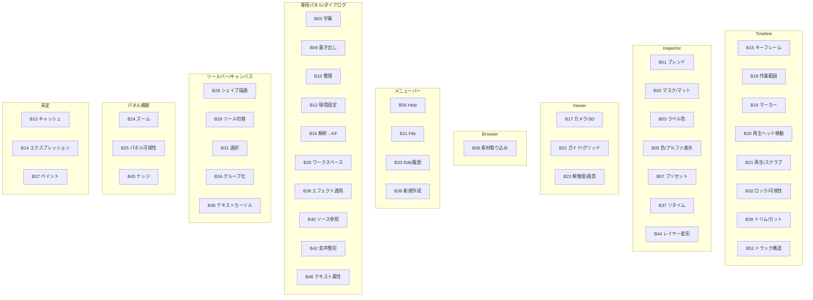
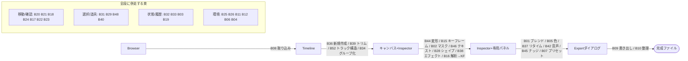

# 意図束の動線図 — 家の地図と編集動線(IB 44束の写像)

日付: 2026-08-22 / 状態: 写像(判断なし — 正本の事実を図にしただけ) / 上位原則: 裁定177(1意図=1つの家)

正本: [`next/reference/intent-bundles.tsv`](../../next/reference/intent-bundles.tsv)(束の定数)+ `next/reference/normal-map.tsv` の `bundle` 列(全1,285対象行の割り付け)。束の起案経緯は [2026-08-22-intent-bundles-draft.md](2026-08-22-intent-bundles-draft.md)。**束名は仮名のまま**(命名は利用者の直観が最上流)。

## 1. 家の地図 — どの家にどの束が住むか

「家」= 束の意図が住む UI 面。正本の `home` 列(草案 §1「家の候補」)をそのまま群別した。**shortcut・キーボード修飾は入口であって家ではない**ため、家の数には数えない(B18 の「+shortcut」、B45 の「キーボード修飾」がこの扱い)。

| 家 | 住む束 |
|---|---|
| Timeline | B15 キーフレーム※ / B18 作業範囲・イン・アウト点 / B19 マーカー・フラグ※ / B20 再生ヘッド移動 / B21 再生・スクラブ / B32 ロック・可視性・リンク / B39 トリム・カット編集 / B52 トラック構造管理 |
| Inspector | B01 ブレンドモード / B02 マスク・マット※ / B03 ラベル色※ / B05 色・アルファ表示※ / B07 プリセット※ / B37 速度・リタイム / B44 レイヤー変形 |
| Viewer | B17 カメラ・3Dビュー / B22 ガイド・グリッド表示 / B23 プレビュー解像度・画質 |
| Browser | B08 素材取り込み※ |
| メニューバー | B06 ヘルプ(Help) / B11 File(MB-1延長) / B33 クリップボード・履歴(Edit、MB-0延長) / B36 新規コンテンツ作成(New submenu) |
| 専用パネル・ダイアログ | B04 字幕(Caption) / B09 書き出し※ / B10 プロジェクト整理(Project Manager) / B12 環境設定(Preferences) / B16 解析→自動キーフレーム(Analysis/Tracker) / B26 ワークスペースレイアウト / B38 トランジション・エフェクト適用(Effects/Transitions) / B40 ソース参照・マルチカム(Source Monitor) / B42 音声内容整形(Audio) / B46 テキストプロパティ(Character/Paragraph) |
| ツールバー・キャンバス | B28 シェイプ・パス描画※ / B29 ツール切替 / B31 選択※ / B34 グループ化※ / B48 テキストカーソル・選択(インライン) |
| パネル横断 | B24 ズーム(各パネル右下) / B25 パネル可視性・フォーカス※ / B45 微調整ナッジ(キーボード修飾、パネル非依存) |
| 未定 | B13 キャッシュ・メモリ管理(継ぎ目、実測待ち) / B14 エクスプレッション(D5未完) / B27 ペイント(MA L9継ぎ目候補) |

※ = 家未決(下記 §1.1)。

### 1.1 家未決の束(1意図=1家の検証で引っかかる12束)

正本の `home` 列に **UI 面が2つ併記されている**束。裁定177の「1意図=1つの家」に照らすとどちらが家か未決 — 利用者裁定待ちの明示リスト。

| 束id | 束名(仮) | 併記されている2面 |
|---|---|---|
| B02 | マスク/マット束 | Inspector maskセクション / キャンバスハンドル |
| B03 | ラベル色束 | クリップ右クリック / Inspector |
| B05 | 色/アルファ表示束 | Inspector color / Viewerオーバーレイ |
| B07 | プリセット束 | Inspector上部 / 専用Presetブラウザ |
| B08 | 素材取り込み束 | Browserパネルdrop / File>Import |
| B09 | 書き出し束 | 専用Exportダイアログ / Render Queue |
| B15 | キーフレーム束 | Timelineキーフレームレーン / Graph Editor |
| B19 | マーカー/フラグ束 | Timelineマーカーレーン / Markersパネル |
| B25 | パネル可視性/フォーカス束 | パネルタブ自体 / Windowメニュー |
| B28 | シェイプ/パス描画束 | ツールバー / キャンバス |
| B31 | 選択束 | キャンバス / Timeline共通 |
| B34 | グループ化束 | キャンバス右クリック / Layerメニュー |

これに加えて **家そのものが未定の3束**(B13 / B14 / B27、上表「未定」行)がある。

### 1.2 家の地図(図)



## 2. 編集動線 — 標準フローがどの家をどの順で通るか

取り込み→配置→編集→調整→書き出しの標準フロー。辺のラベルが「その遷移を運ぶ束」。



併走群は特定の段に属さない(どの段でも使う)ため辺に載せず枠で示した。B13/B14/B27(未定)と HOMELESS 3行(verdict 再審キュー: 1382/1383/1424)は動線に載らない。

## 3. 検証ログ(check.sh の意図束3検査ほか)

`next/check.sh` へ追加した3検査 — (a) 採用済/採用予定/保留/拡張の全行に bundle 記入(不採用は空欄) (b) bundle id が intent-bundles.tsv に実在 (c) 束ごとの行数が size 申告と一致 — の実行出力:

```
=== 意図束(normal-map bundle 列 ⇔ intent-bundles.tsv)===
  束 45 / 割付 1285行 — 記入完全性・id実在・size一致の3検査 全通過

OK: wraps/owns marker 全通過
EXIT=0
```

草案 §2 の割り付けを Python で独立再構成した検証(重複ゼロ・欠落ゼロ・size一致):

```
§1 bundles: 44, §2 bundles: 44
map rows: 1551 cols: 14
scope size: 1285
duplicates across bundles: []
missing (in scope, unbundled, not homeless): []
extra (assigned but out of scope): []
homeless in scope: [1382, 1383, 1424]
size mismatches (bid, declared, actual): []
total bundled: 1282 + homeless 3 = 1285 vs scope 1285
```

normal-map.tsv の diff が「全行への1列追加」だけであることの機械確認:

```
OK: 全1552行 = 旧行 + タブ + bundle 1フィールドのみ
 next/reference/normal-map.tsv | 3104 ++++++++++++++++++++---------------------
 1 file changed, 1552 insertions(+), 1552 deletions(-)
```

既知のズレ(草案と共有チェックアウトの差、行割り付けには影響なし): 草案 §1 の状態rollupが2束で古い — B01 は実測「採用済11/採用予定22」(草案: 採用済2/採用予定31)、B34 は実測「採用済6/採用予定1」(草案: 採用予定7)。BL3/グループ化レーンの回収後に verdict が動いたもの。草案 §0 の「採用済126」も §1 rollup 合計(130)と実測(145)の双方と不一致。行id→束の対応そのものは重複ゼロ・欠落ゼロで一致。
