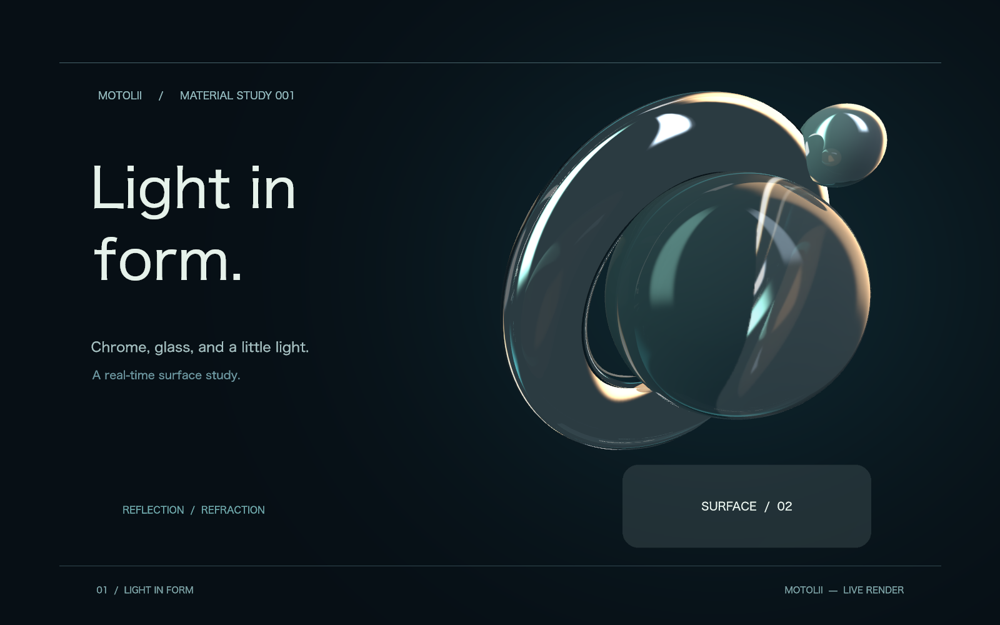
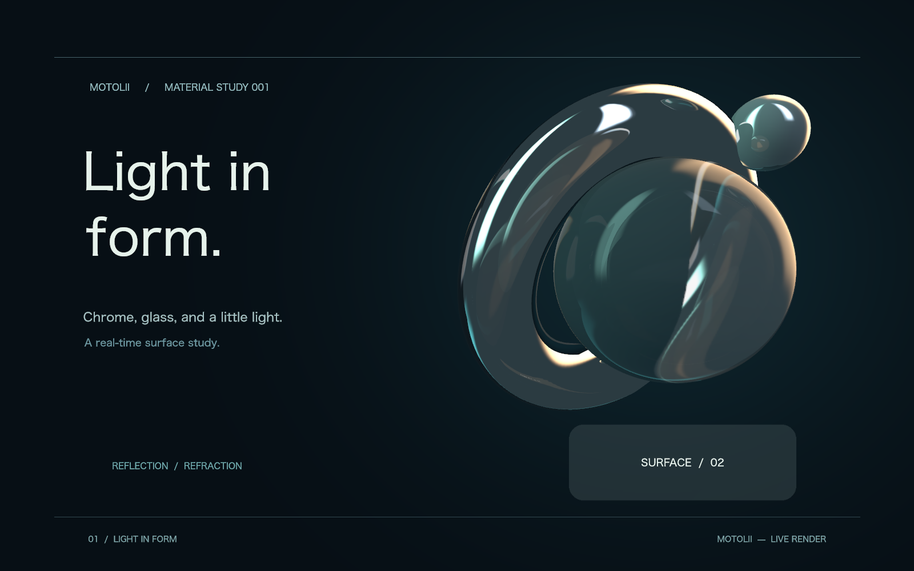

# ドーナツと球の近接で反射が跳ぶ

状態: **観察**。root `929979ab` / re_renderer `145ed61a3916dc556bd4d1900ceb20e9b0f977aa`。利用者が実窓で近接時の連続性喪失を報告。現在の共有反射には、動かしたときの不連続がある。AAの画素一致・速度比較はこの性質を検証していなかった。製品修正は未実施。

実窓は未保存の`light-in-form.rrd`、sphere 2がposition=(1071.09,479.21,-200)、frame 36。ユーザの操作状態を変えず、保存済み同作品のコピーをEngineへロードし、球のY=479.21、X=870..1170を1ずつ変えて301枚を描いた。時刻は0（このfixtureにアニメーションはない）、高品質＋TRANSIENTの製品設定。1089→1090でドーナツの広範囲の映り込みが急変した。

| 球のX | 出力 |
| --- | --- |
| 1089 |  |
| 1090 |  |

[隣接frameのRGBA絶対差合計](assets/2026-09-09-contact-continuity/deltas.json)はこの境界で5,064,979、全300差分の中央値958,292.5の5.29倍。差分量だけを連続性の合否閾値にはしていない。画像でドーナツ上の反射像が置き換わることと、下記の離散的な分岐を併せて診断した。

`compositor/surface_scene.rs::capture_scene_reflection`は表面候補を中心X→Y→Z順で比較し、最小・最大の2物体を撮影元として選ぶ。それぞれの撮影ではその物体を除外する。球がドーナツのXを跨ぐと最小候補が球からドーナツへ交代し、原点だけでなく除外対象も切り替わる。shaderの2地点間blendは連続でも、その入力自体が突然別の画像になる。

これは近接そのものの物理的な変化ではなく、動的な撮影元選択に由来する不連続。接触部の屈折・遮蔽やcube面継ぎ目がこれで全て説明できるとはしていない。[Unityのprobe blending](https://docs.unity.cn/Manual/UsingReflectionProbes.html)も遷移時の段階的な混合を扱うが、現行の離散的な撮影元交代を現在の2画像blendだけで補えていない。

次の修正には、撮影元の選択・除外・投影を一体として連続に保つ設計が必要。単に前frameを混ぜる方法は任意frame直行・逆シーク・export一致を壊し得るため、その場しのぎとして採用しない。近接、中心の交差、離反、逆方向、同frame再描画を画質と費用の受入条件に追加する。

再現用のignored診断は画像出力であり、修正済みを示す回帰試験ではない。

```sh
MOTOLII_CONTACT_DIR=/tmp/motolii-contact cargo test -p motolii-render --all-features gallery_near_contact_continuity -- --ignored --nocapture
```
