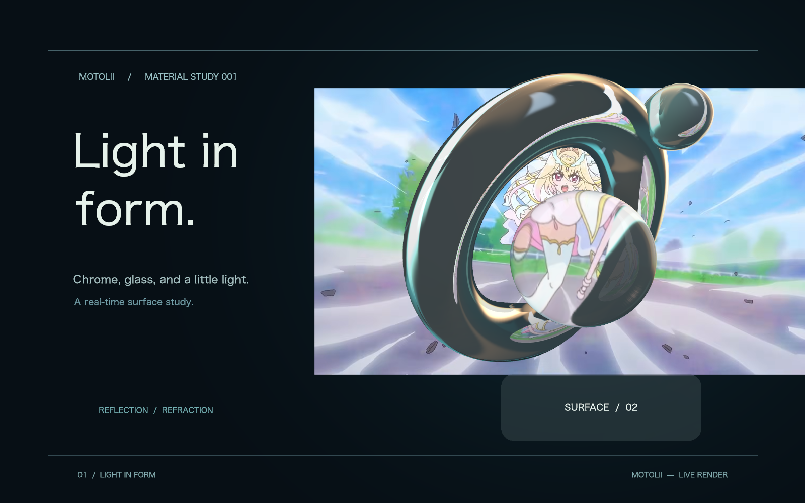
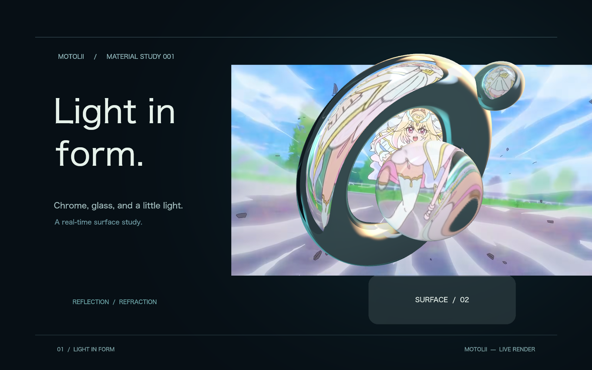
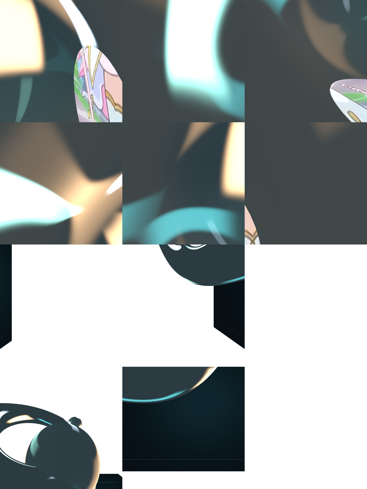
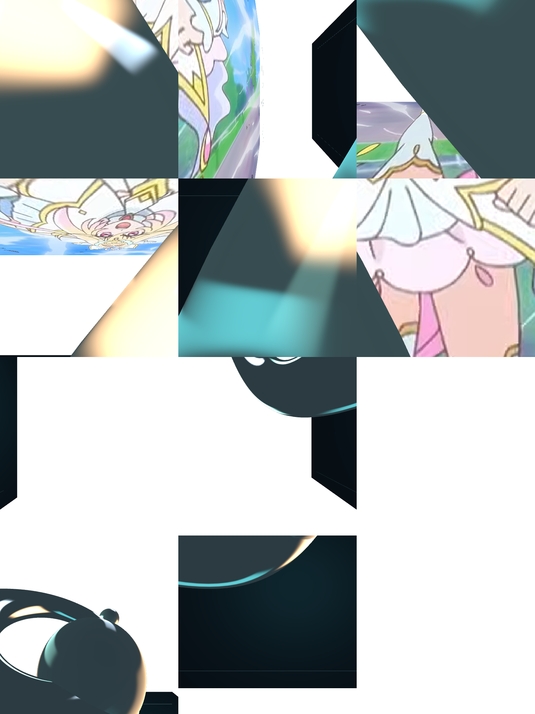

# 共有反射の撮影点を球が跨ぐ場合の診断

状態: **観察**。利用者が研究資料を踏まえた診断を依頼し、途中でヘッドレス検証を指定。製品の反射方式やnativeアプリは変更・再起動せず、test-onlyの撮影画像読み出しと対照条件で調べた。

## 保存と再現条件

20:36時点の保存済み作品を`/tmp/motolii-visibility/input.rrd`へコピーした。追加画像・アニメーションが残っている。スクリーンショット後の保存ではcardが削除され、sphere 2のblendがScreenへ変わっているため、診断コピーでは元galleryのcardを同じ位置・素材・Glass設定で復元し、球をNormalへ戻した。元の保存ファイルは上書きしない。

1600×1000、frame 17を固定。sphere 2のZ=130.41171875、scale=(154.08619140625,154)、rotation=-58.103515625を保持。スクリーンショットから読めるXY=(1198,514.7)〜(1231,538.7)を32分割して描いた。XYの丸めや、その後の変更があるため、元スクリーンショットとの全画素一致は主張しない。両端でリングと小球の映り込みが大きく変わる見え方は再現した。

## 診断方法

既存のGPU計測bufferと同じ`map_buffer_on_submit`の仕組みで、通常frameの完了待ちに合わせて反射atlasを読み出す。新しい待機や描画passは作らない。撮影元index・位置・proxy bounds・radii・入力ごとのworld transform・表面パラメータをJSONへ記録する。計測を無効にした別Engineと、最初のframeの全画素一致を確認した。

対照では大きい球を反射撮影からだけ除外する。主ビューには球を残し、撮影地点やproxy boundsの選択も変えない。反射cacheを無効化し、共有GPU instance経路も両側で無効化して、この除外条件が確実に効くようにした。この対照は原因を分離するためであり、球の映り込みを消す修正案ではない。

実際のsphere.objの三角形と描画時のworld transformを用いて、撮影点から64方向の最近接交差をCPUで評価した。[Möller–Trumboreの交差判定](https://doi.org/10.1080/10867651.1997.10487468)を使用。外向き法線に対する表裏を数える。GPUの表裏bufferを読み出した数ではなく、geometryに対する独立した照合である。このfixtureにはmeshのdisplacementやskin変形はない。

## 結果

撮影元はtorusとcard（入力index 3と6）。撮影位置は(1090,460,約40)と(1195,810,0)。33位置の全区間で、撮影元・撮影位置・proxy boundsは固定されていた。

最も大きな変化は球のXY=(1200.0625,516.2)→(1201.09375,516.95)で発生。最初の撮影点が球の内側から外側へ出る位置と一致した。

| 指標 | 球を撮影に含める | 球を撮影からだけ外す |
| --- | ---: | ---: |
| 最終frameのRGBA絶対差合計 | 40,174,366 | 1,105,293 |
| 動かしていないリング上部の差分 | 7,834,104 | 0 |

リング上部の測定領域はx=900..1229、y=120..244。大きい球の主ビュー上の形状がこの領域を横切らない場所を選んだ。差分は品質スコアやfpsではない。

CPU交差判定では、球の内側にある撮影点からの64方向すべてが球の裏側へ交差。外側へ出た後は31方向が表側へ交差し、裏側への交差は0となった。反射atlasの最初の6面にも、球の内側の像から外部の画像が広く現れる変化を確認した。2番目の撮影画像はこの位置で同様の急変を起こしていない。

実際の三角形境界は、この移動経路上で球X≈1200.92519。±0.1〜±0.001の追加サンプルでは、変化が境界近傍へ集中することを確認した。近クリップ距離0.01を診断条件として0.001へ下げても現象は消えず、より狭い範囲に集中した。後者では約0.001の移動で最終frameのRGBA差分が21,573,028となる区間があった。有限精度・有限サンプルの観測であり、数学的な不連続の証明とはしない。

### 因果の整理

1. 撮影元の再選択や場所の飛びではない。
2. 固定された撮影点を球の表面が跨ぎ、そこから見える内容が急変する。
3. その画像を外側のリング・小球へ使うため、局所的な移動が広範囲の見え方を変える。
4. 現在のRGB＋coverage、範囲、距離blendには、各texelが何の面をどちら側から見た像かを判定する情報がない。

したがって、撮影点を固定するだけでも、近クリップを調整するだけでも根本原因は残る。次の表現には、受け取る表面から見て情報が有効かを判定する契約が必要。候補は距離・法線・表裏・物体識別・透過の情報であり、どれを採るかは未決定。裏面を全て消すだけでは両面の板や透過面の意味を壊すため、そのまま修正とはしない。

[Scaling Probe-Based Real-Time Dynamic Global Illumination for Production §5](https://arxiv.org/html/2009.10796)が、動的物体を避けてprobeを動かす不安定さと、probeが動的物体を通過する場合を扱う点は、この診断に関係する。ただし同論文の拡散光向けの処理を、この鏡面・ガラスへ直ちに採用する根拠とはしない。

## 証拠と再実行

[集計](assets/2026-09-09-reflection-visibility/summary.json)、[全区間](assets/2026-09-09-reflection-visibility/sweep.json)、[geometry照合](assets/2026-09-09-reflection-visibility/geometry-analysis.json)、[微小移動](assets/2026-09-09-reflection-visibility/fine-sweep.json)、[近クリップ対照](assets/2026-09-09-reflection-visibility/fine-near-sweep.json)。

| | 境界の内側 | 境界の外側 |
| --- | --- | --- |
| 主ビュー |  |  |
| 反射atlas（上半分が撮影点0） |  |  |

```sh
MOTOLII_DIAGNOSTIC_SCENE=/tmp/motolii-visibility/input.rrd MOTOLII_DIAGNOSTIC_DIR=/tmp/motolii-visibility/result cargo test -p motolii-render --all-features capture_visibility_diagnosis -- --ignored --nocapture
```

入力コピーと参照する画像はローカルに保全。`MOTOLII_DIAGNOSTIC_POSITIONS`でXY配列JSON、`MOTOLII_DIAGNOSTIC_NEAR`で診断用near値を指定できる。これらはtest-onlyで、製品設定ではない。実行は元のsphere/card layer IDに依存するこの作品用の診断であり、任意作品用の自動検査器ではない。

通常描画試験は59件成功・診断類5件ignored。診断の各条件は明示実行で成功し、診断読み出しの有無でも画素一致を確認。owned-budgetは既存試験と同じsourceカウントで一致。入力と追加画像のバックアップはローカルstateのdiagnostics/visibility-20260909へ保全した。

文書checkerは既存の状態語「未決」で失敗している。新規文書は索引へ登録し、差分の空白検査は成功。他タスクのUI変更・文書変更は本変更に含めない。
