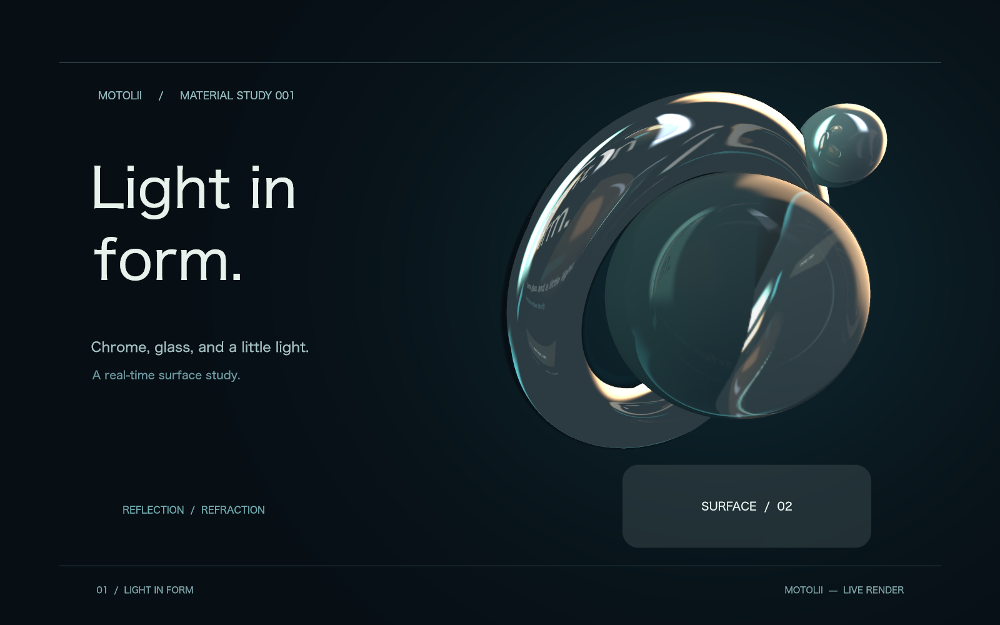
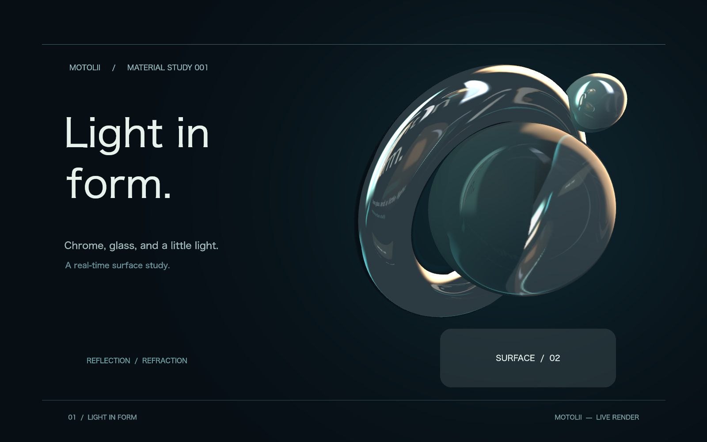

# 表面応答の合成に向けた撮影情報の比較

状態: **観察**。利用者「ok検証をお願いします」。基準root `d309e3ba`、re_renderer `145ed61a3916dc556bd4d1900ceb20e9b0f977aa`。製品設定・ユーザーの未保存作品は変更せず、test buildに限定した候補で比較した。撮影選択の不連続は抑えられるが、自然な反射まで成立したとは判定しない。製品採用なし。

根拠は[近接時の既存不連続](2026-09-09-contact-reflection-continuity.md)、[Armの異方式反射合成](https://developer.arm.com/community/arm-community-blogs/b/mobile-graphics-and-gaming-blog/posts/combined-reflections-stereo-reflections-in-vr)、[Unity URPの画素ごとのprobe寄与](https://docs.unity3d.com/ja/6000.0/Manual/urp/lighting/reflection-probes-introduction.html)、[AMDの交差結果の信頼度](https://gpuopen.com/manuals/fidelityfx_sdk/techniques/stochastic-screen-space-reflections/)。後2者にも設定値があり、任意シーンの無調整な成立を保証する資料ではない。

比較は3方式。0=現行の左右端receiver。1=入力順の先頭・末尾receiverを使う固定対象の対照。2=scene boundsの中心からX方向に幅の±1/4だけ離した2地点、撮影からreceiverを除外しない連続anchor候補。全て同じ既存shaderの距離による2地点blendとalphaによる環境fallbackを使う。新しい深度による信頼度判定はまだ実装していない。まず情報源が変わる問題を分離し、不足する情報を特定するための実験である。

球Y=479.21、X=870〜1170の28位置（中心交差付近は1刻み）。各方式の順を巡回してforward/reverseを描画し、逆方向とcache破棄後の直接seekで全画素一致を要求。RGBA差分は診断値であり自然さの点数ではない。1089→1090、接近前、離反後の画像を目視し、反射消失・二重像・位置ずれ・自己像を観察する。計時はCPU準備＋GPU完了待ち＋readbackを含み、実窓fpsやGPU単体時間ではない。

## 結果

Apple M4 / 1600×1000 / dev build / 独立2回。時間は各方式108個の反射12面更新sampleの中央値。cache hitを除外し、2warmup後のforward/reverseを集計。別姿勢・別負荷の前回AA計測とは直接比較しない。

| 方式 | X1089→1090のRGBA絶対差 | 周辺1刻み差分の中央値に対する倍率 | 総時間中央値 |
| --- | ---: | ---: | ---: |
| 現行 | 5,064,979 | 5.83倍 | 27.563 ms |
| 固定receiver対照 | 781,825 | 1.010倍 | 26.825 ms |
| 連続scene anchor候補 | 830,824 | 1.007倍 | 26.158 ms |

周辺はX1081〜1100、切替点1090を除く。両候補は反射を消したり前frameを混ぜたりせず、各frameで12面を撮影している。少なくともこの経路では、左右順の交代に伴う外れ値は解消した。両方向とcache破棄後の直接seekは全画素一致。費用増は観測されなかったが、1作品の短いdev計測から一般的な高速化を主張しない。

一方、固定receiver対照では切替前から反射像が現行と異なる。連続anchor候補ではリング上部・球内部に複数の細い像が重なり、文字の反射も出る。文字が映ること自体は誤りとは限らないが、現行画像は光学的な正解画像ではなく、これらの像の位置・遮蔽が自然かを定量保証する比較基準もまだない。したがって差分値の改善を画質の改善として採用しない。

今回の候補は撮影元の制御と既存blendの検証であり、AMD型の深度・裏面・画面端からの信頼度合成の検証ではない。その賭け全体を成功と報告しない。次の候補では色だけの2枚blendへ係数を足す前に、反射像の由来・距離・遮蔽に対応する情報を取得し、情報不足を判定できるようにする必要がある、という設計上の示唆を得た。これは本実験からの推論であり、特定実装の採用決定ではない。

共通応答を維持する方針は残る。ユーザーへprobe選択を要求せず、撮影情報の有効性を機械処理する。接近・交差・離反の横移動は検査したが、別カメラ・Z方向移動・多重透過・異なる素材・大量複製は今回の検証外。実窓の製品設定は変えていないため、候補のnative UI検収は未実施。

[集計](assets/2026-09-09-response-comparison/summary.json)、[run 1](assets/2026-09-09-response-comparison/run-1.json)、[run 2](assets/2026-09-09-response-comparison/run-2.json)。

| 方式 | X1089 | X1090 |
| --- | --- | --- |
| 現行 |  |  |
| 固定receiver |  |  |
| 連続anchor |  |  |

```sh
MOTOLII_RESPONSE_DIR=/tmp/motolii-response cargo test -p motolii-render --all-features gallery_probe_response_comparison -- --ignored --nocapture
```

通常render試験57件成功、診断benchmark4件ignored。候補の比較試験は独立2回成功。test-onlyの切替であり、製品binaryの描画経路は変更していない。
