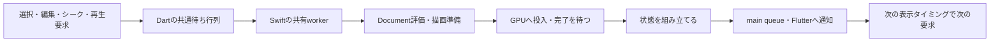

# 操作応答の構造監査 — 2026-09-09

調査対象: Stage 5のFlutter / Rust / re_rendererの現行経路。基準HEADは `1ea88a6b6ab086156194663cbf95c365737c9c12`、未コミット変更を含む。前段の状態取得改善を適用した後のコードを読む。調査中も別の編集が進んでいるため、以下はこの時点の構造であり、全変更の検収ではない。今回は製品コードを変更していない。

## 判定

根本候補は、**操作が変えた範囲より広い仕事を発生させ、その完了を編集・再生・表示が一緒に待つ構造**。ガラスの単体コスト、Flutterの選択、CPU全体の使用率だけでは説明できない。

前の修正は共通経路の定数コストを減らした。必要な仕事の範囲、仕事の共有単位、待ち合わせの単位は大部分そのまま。以下はコードで確認した構造と、その影響の推論を分ける。全てが同じ割合で体感に寄与したという実測ではない。

## 1. 変更の意味と、更新の範囲が一致していない

事実: `ui/lib/bridge/protocol.dart:86` の `requiresRender` は除外リスト方式。`select`・`animate`・marker編集等も再描画側に入る。`ui/native/src/port.rs` のselectは選択状態を変え、Documentの画素内容を編集しない。native renderはDocument、時刻、view cameraから画像を作り、選択IDを描画入力に渡していない。ただしselect等の入口は既存previewを取り消すため、下書きがある場合は画像内容も変わり得る。ここで指摘する余分な描画は、preview等の画素入力が変わらない通常の選択を含め、無条件に要求する点。

事実: `editor_session.dart:335` は命令の返信を受け取って通知し、その後renderを待つ。通常の命令返信はFFIで `status()` を生成し、renderも最後に `status()` を生成する。描画前の寸法問い合わせを軽くした後も、停止中の一般操作にはこの二つの状態生成が残る。

帰結: レイヤーを選ぶだけの操作が、Inspector更新・全体状態生成・作品画像の再描画へ波及する。操作頻度が上がるほど、エフェクトを除去しても消えない負荷になる。

必要な契約: 作品の変更、選択、再生時刻、観測カメラ、パネル内の状態が、何を無効にするかを区別する。操作名の除外リストを増やすだけでは、新しい操作を追加するたび同じ問題が戻る。実際に発生したpreview取消等の付随変更も、無効化の入力へ含める。選択用の枠・ヒットテストは更新しても、同じ作品画像は再利用できることを検証する。

## 2. 書き込みの一元化と、すべての処理の直列化が重なっている

事実: Dartの `_serial` (`editor_session.dart:176`) が編集・描画要求を同じFuture列に入れる。再生Ticker (`:387`) は `_pendingWork > 0` なら要求を出さない。Swiftにも共有Document worker (`MainFlutterWindow.swift:213`) があり、画像生成・GPU完了待ち・状態生成を含む仕事を直列処理する。結果をmain queueへ返してからFlutterへ通知する。

帰結: 遅い描画があると、その後の編集も待つ。GPUが空いても次のTickerまで次の仕事が出ない場合がある。単一フレームの平均時間を短くしても、入力から表示までの待ち時間や間隔の揺れを取り切れない。

必要な契約: Documentへの確定編集の順序は一つに保ちつつ、読み取り用の確定した評価結果と画像生成の寿命を切り離す。途中のスクラブ要求は最新にまとめてもよいが、commit・Undo・保存を捨ててはいけない。無制限に先行フレームを溜める案も入力遅延を増やすため不可。GPU完了待ちの単純削除は共有surfaceの安全性を壊す。

## 3. 保存モデルから読むたびに評価し、同じ評価結果を使い回す境界が弱い

事実: `motolii-doc/src/store/view/resolve.rs:660` の `resolved_layers` は各呼び出しで親変換等のmemoを作る。`motolii-render/src/engine/render.rs:343` の直接出力経路がこれを呼び、描画後の `ui/native/src/snapshot.rs:150` も同じ時刻にこれを呼ぶ。snapshotはさらに全layerのInspector情報を作る (`:158`)。

ただし「キャッシュがない」は誤り。RecordCache/TrackCache、文字・図形のテクスチャ、素材、反射のキャッシュがある。文字画像は時刻そのものではなく、評価後の内容・書式等からキーを作っており、時刻が進むだけで必ず再ラスタライズされる設計ではない。

帰結: 下位の読み取りや画像を再利用できても、上位の評価・変換・snapshot生成が繰り返される。read cacheと、同じ時点の評価結果を共有することは別。さらにRecordCacheとTrackCacheの無効化はDocument版単位なので、局所的な確定変更でも広い読み取りキャッシュが消える。

必要な契約: 同一の作品版・下書き版・時刻・観測条件で評価した結果を、描画・bounds・Inspector投影が共用する。これはDocumentと並ぶ第二の編集正本ではなく、再生成可能な読み取り結果。依存していない部分は無効化しない。最初から巨大な独自DAGを作る決定は不要で、まず依存と無効化の契約を明確にする。

## 4. UIへ渡す情報が、利用場所と更新頻度で分かれていない

事実: 停止中の `status()` は保存状態判定、素材情報、パネル記述、全layerの値・キー・bounds等をまとめる。`editor_session.dart:173` は新しいMapをdocument notifierへ渡す。Timeline (`panels/timeline.dart:896`) はその通知で行レイアウトを組み、Browserもdocument notifierに依存する。Stageはdocumentとrenderedの両方を購読する。複数窓へはSwiftのbroadcastが同じ状態を配る (`MainFlutterWindow.swift:224`)。

一方、再生中は `frameOnly` / `notify:false` による分離が既にあり、Timelineのヘッド等も局所的に購読する。すべてのフレームで全画面のlayout/paintが走る、という断定はしない。Flutterはbuild要求をまとめるので、通知数と実際のbuild回数も同一ではない。

帰結: 低頻度の素材・スキーマ・履歴と、高頻度の値・時刻・画像が、停止中の操作では広く結び付く。Mapの型を付けるだけでは購読粒度は変わらない。Inspector一つが見たい値のために、全layerをInspectorの形式へ変換するコストも残る。

必要な契約: 各consumerが必要な投影と頻度を明確にし、未変更の投影は通知しない。同じフレーム内のlayer overlayも、各getterが何度もMapとして組み直す必要がないよう、再利用単位を決める。

## 5. 安全に処理を切り離すための結果識別が足りない

事実: Documentには `DisplayRevision` と transient generationがある (`document.rs:152`)。対してDartの `renderedIsFresh` (`editor_session.dart:80`) が比較するのは主にframeとdocumentRevision。Swiftのepochは書類・窓の置換用で、各preview・view camera要求の識別とは別。現在の直列処理が整合性を助けている。

帰結: 単に描画を別スレッドへ逃がすと、同じDocument版・同じframeでも、古い下書きや観測カメラの結果が後から届く問題を扱えない。これは現窓で発生を観測したバグの断定ではなく、非同期化に先立つ契約の不足。

必要な契約: 表示される画像と値・boundsが、作品版、preview世代、時刻、view条件の同じ評価結果を指すこと。古い結果の破棄、取消、surfaceの再利用可能時点を定義する。Stageの画像と別の滑らかなヘッドだけで完了扱いにしない。

## 6. 測る境界も利用者の待ち時間と一致していない

事実: `ui/native/src/lib.rs:113–152` のrenderMsはnative render内部からGPU待ちまで。入力がDartの待ち行列にいた時間、描画後の状態生成、main queue、Flutter表示までを含まない。画像readback経路には詳細なFrameMeasurementがあるが、直接共有surfaceへの経路と同じ測定範囲ではない。前のsample割合もGPU timestampではない。

帰結: rendererの数字やmicrobenchmarkだけが改善しても、「まだ重い」は成立する。テスト件数・compile成功・一度再生できたことは、応答性の検収ではない。

必要な契約: 入力受付→適用→評価→GPU投入/完了→画像とUIの公開を同じ要求・世代で追う。待ち行列の滞留、捨てた古いpreview、評価/描画回数、各キャッシュ再生成、表示間隔の分布を確認する。数値の目標は対象ディスプレイと操作の条件から決め、任意の一つのFPSを全操作の合格基準にしない。

## 外部の定規

- [Blender dependency graph](https://developer.blender.org/docs/features/core/depsgraph/): 元の作品データと評価後データを分け、変更に依存する部分を更新する設計。MotoliiへBlenderの実装全体を移植すべきという結論ではない。
- [Inside Flutter](https://docs.flutter.dev/resources/inside-flutter): dirtyになったelementを更新し、未変更部分を飛ばす仕組み。Flutter採用だけでアプリ側の広い通知範囲が自動的に狭くなるわけではない。
- [Apple: Triple Buffering](https://developer.apple.com/library/archive/documentation/3DDrawing/Conceptual/MTLBestPracticesGuide/TripleBuffering.html): 資源競合を防ぎながらCPU/GPUの待機を減らす。先行しすぎればメモリと遅延が増える。動的bufferの先例であり、Flutter IOSurfaceを無条件に3枚へ変える処方ではない。

## 根治の入口と反証条件

| 優先 | 調べる操作 | 構造として期待する性質 | 反証に必要な記録 |
|---|---|---|---|
| 1 | 停止中にlayerを選ぶ／Animateを切り替える | 作品の画素入力が同じなら画像を再利用する | Document版、画像render回数、選択枠・Inspector更新 |
| 1 | 1個の値を編集する | その値と依存先以外の評価・通知を増やさない | 変更集合、依存先、評価回数、panel通知 |
| 2 | 同じ時刻を描画し、値・boundsを表示する | 同じ評価結果を共有する | 評価identityと各consumerの参照 |
| 2 | GPUが遅い場面で連続操作し最後に確定する | 中間previewはまとめ、最終値とUndoを保ち、古い結果を出さない | 入力列、適用順、表示世代、commit/Undo結果 |
| 3 | 静止作品の再生／1個だけ動く作品の再生 | 時刻依存の無い仕事を再生成しない | 時刻依存集合、再評価/再生成回数 |
| 3 | Inspectorを閉じる、素材数や窓数を増やす | 不要な投影がStageの応答時間へ広く波及しない | consumerごとの費用と待ち時間 |
| 4 | ガラス有無、反射入力が静止／移動する | GPU shadingと反射再生成と待機を別に説明できる | 同条件A/B、GPU pass時間、reflection hit/miss |

これらは提案する検証項目で、今回すべてを実行したものではない。現時点の第一候補は1と2。効果を削る、全体解像度を落とす、frameworkを置き換える判断に先行する。

## 後続の分離計測

[操作・状態生成・描画経路の分離計測](2026-09-09-frame-pipeline-measurements.md)で、ガラスを外し画像を描かない選択要求にも約10msのnative費用があることを確認した。GPU単体実行時間とFlutter込みの入力遅延は未確定。
