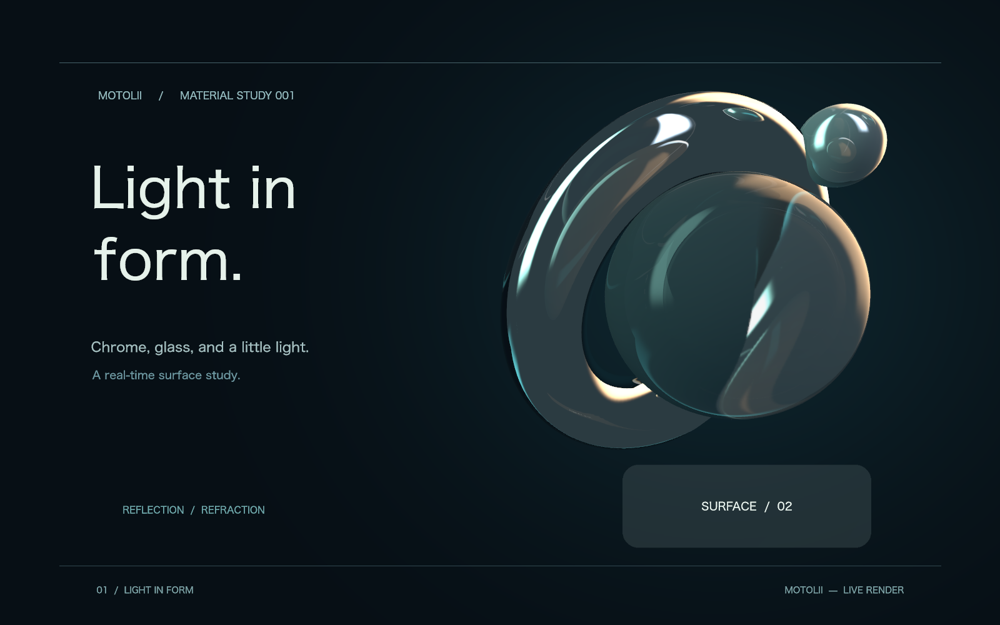

# 共有反射の選択と寄与の修正

状態: **縮小採用**。利用者「ではお願いします」。既存の比較 `ea60280d` を基準とする。他タスクの3文書と未追跡計画を保持。脱線した用途例は仕様に含めない。

1. 既存の左右順による撮影元選択を、評価sceneの入力順による選択へ変更する。移動で撮影元と除外対象が突然入れ替わらない。同一frameの再現性を保ち、履歴で撮影元を固定しない。
2. re_rendererの共通表面shaderへ、probeごとの空間的な有効範囲を渡す。全receiverのboundsを包含する範囲を機械的に作り、範囲端で寄与を落とし、その不足とcaptureの未被覆を環境で補う。距離による2画像blendは残し、寄与の合計が増幅しないようにする。
3. これは[Unity URPのprobe influence](https://docs.unity3d.com/ja/6000.0/Manual/urp/lighting/reflection-probes-introduction.html)と[Armの反射合成](https://developer.arm.com/community/arm-community-blogs/b/mobile-graphics-and-gaming-blog/posts/combined-reflections-stereo-reflections-in-vr)を参照する空間的な有効性であり、深度hitの正しさを判定するSSRのconfidenceではない。ユーザーへprobe設定を要求しない。
4. 元方式、固定receiver対照、採用候補を同binaryで比較。交差・逆方向・cache破棄・カメラ変更・透過・2D反射と、描画費用を検証。候補画像を確認してからnativeへ反映する。撮影は最大12面を維持する。

最終画の光学的一致を要求して近似を捨てるのではなく、材質の印象、操作に対する応答、情報の切替を検収する。任意の曲面に対する正確な遮蔽・多重反射が実現したとは扱わない。

## 実装

re_renderer fork `55fa777d9b7740f40673e3a5788eee8c634b2355`。`SceneReflection.influence_radii`と既存frame uniformの未使用成分で空間的な有効範囲を渡す。新規texture・pass・pipelineは追加しない。2地点を同じ位置へ移しても異なるreceiverなら撮影数を変えず、距離blendの分母は有効範囲を使う経路で連続に正則化する。

全receiverのboundsを含む保守的なradiusを自動算出する。各radius内とscene proxy box内は寄与を保つ。範囲外ではsmoothstepで寄与を下げ、coverageと合わせた残余を環境反射で補う。boxの外は投影位置をbox上へclampし、projectionの突然の切替を避けつつfallbackへ移る。これは近似の空間的な有効範囲で、見えている物体の深度や自己像を判定するconfidenceではない。

最初の候補ではbox内側の境界でfadeしたため、box面上にある平面鏡の反射が消える回帰が3試験で発生した。内側を保持する形へ修正し、59件すべて成功。採用画像は修正後に再測定した。旧方式と固定receiverの比較はtest-only切替で残す。

## 最終比較

Apple M4、1600×1000、dev build、各方式54回の12面更新を独立2回（108 sample）。warmup 2、28位置の往復で実行順を巡回、cache hitを計時集計から除外。CPU準備・submit・GPU完了待ち・readback込み。実窓fpsではない。

| 方式 | X1089→1090のRGBA絶対差 | 周辺中央値に対する倍率 | 総時間中央値 |
| --- | ---: | ---: | ---: |
| 旧左右順方式 | 5,064,979 | 5.830倍 | 26.519 ms |
| 固定receiver対照 | 781,825 | 1.010倍 | 25.990 ms |
| 採用方式 | 781,825 | 1.010倍 | 26.550 ms |

この作品では表面が有効範囲内にあるため、採用方式と固定receiver対照の交差点の差分値は同じ。改善の主因は撮影元の選択変更であり、空間的なfadeによる改善と誤認しない。有効範囲は保守的に全receiverを含み、内側の反射寄与を減らさない。旧方式のX1089画像は既存の不連続再現PNGとバイト一致。物理的な正解画像との一致を採用根拠にはしていない。

逆方向とcache破棄後の直接seekは全画素一致。59件の通常描画試験成功。追加の回帰試験は交差点の差分外れ値と、異なる2receiverの中心が一致しても撮影数が変わらないことを検査。既存の画面外反射、2D透過、編集・Undo・camera復元、1000複製の共有予算も成功。owned-budgetは既存試験と同じsourceカウントで一致。

任意の曲面に対する正確な自己像・遮蔽や、追加削除・素材切替などによるscene構成変化の滑らかさまでは保証しない。全反射を単一の物理解へ置換する変更ではなく、現在の共有反射の応答を安定させる修正である。

[集計](assets/2026-09-09-stable-reflection/summary.json)、[run 1](assets/2026-09-09-stable-reflection/run-1.json)、[run 2](assets/2026-09-09-stable-reflection/run-2.json)。

| | X1089 | X1090 |
| --- | --- | --- |
| 旧方式 |  |  |
| 採用 |  |  |

## 保存操作中のアプリ終了

更新前の実窓でFile→Save asを操作した際、Flutterの`AccessibilityBridge::CreateRemoveReparentedNodesUpdate()`内でSIGSEGV。既存の同型crashと一致。描画変更をnativeへbuildする前の旧binaryで発生した。元の保存済みgalleryは変更されていない。

直前の自動保存は発見できず、画面で確認できたsphere 2のposition=(1071.09,479.21,-200)を元galleryへ適用し、ローカルのrecoveryディレクトリへ別ファイルを作った。表示値の丸めがあるため完全復旧ではなく、Undo履歴も復元できていない。球以外の未保存変更があったか利用者へ確認中。元作品や他タスクの差分を上書きしない。

## 実窓とchecks

native build成功。復元コピーを開き、sphere 2をX=1089→1090へ数値入力して、反射像の突然の交代が出ないことを実窓でも確認した。その後X=1071.09へ戻し、frame 36へ戻した。検収用のUndo履歴を残さないよう保存済み復元コピーを再起動して開く。これは失われた元のUndo履歴の復元ではない。

Clippy成功（警告あり）。docs checkerは既存の状態語「未決」で失敗。hygieneはincremental 198件、最長2804行、800行超23件で失敗し、target 71GiBは警告。既存の長大file問題は今回の変更で解消しておらず、fork更新に伴うcache増分は保持している。全体checks成功とは扱わない。
