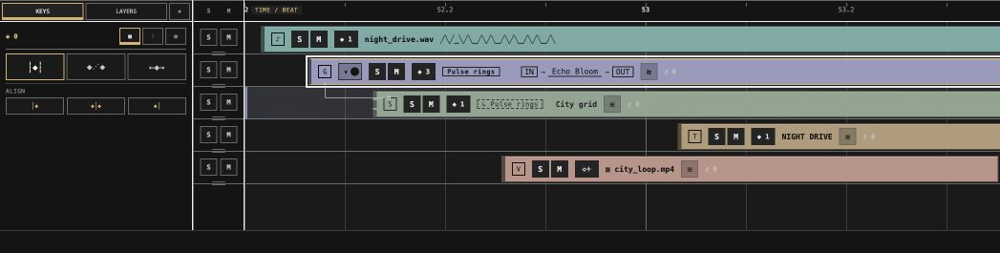
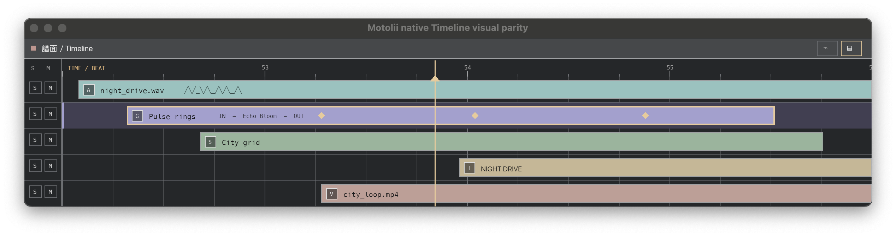

# G0-9 native Timeline visual parity first pass（2026-07-21）

状態: **責任境界PASS / 外観first pass PASS / 製品操作は未接続**。

接続済みReact worktreeの`TimelineCandidate`をoracleとして実画面を採取し、製品workspace外の隔離spikeで
同じ5 object fixtureをdirect wgpu primitive batch + GPU textへ投影した。Document、D2、selection正本、
製品theme token、公開APIは変更していない。

## 所有境界

- React: `KEYS / LAYERS`切替、Align / Stagger / Stretch等のtool panel
- native: time ruler、row同期S/M rail、bar、key、playhead
- native: Z軸Timeline / depth rail。depth row、selection、zoom、scroll、hit-testをtime planeと同じ
  headless interaction kernelへ接続する
- Host coordinator: semantic fixture / snapshotの唯一のowner。React/nativeはread-only projection

React tool panelをnativeへ写さないことはunit testで固定した。Z軸をnativeにする決定は、このfixtureがZ軸UIを
実装済みという意味ではない。次のdepth fixtureでも状態ownerを増やさないための責任境界である。

## 画面証拠

React oracle（Timeline dock全体。この左tool panelはReactに残す）:



native first pass（time-synchronous操作面だけ）:



native側はrect、line、bar、diamond、playheadを1 primitive bufferへまとめ、textは
[`glyphon 0.11`](https://docs.rs/crate/glyphon/0.11.0)で既存wgpu render passへ描いた。`glyphon 0.11`は
このspikeと同じ`wgpu 29`系を要求するため、別GPU runtimeを持ち込まない。

## 自動結果

Apple M4 / Metalで120 frameを実windowへpresentした。

| 項目 | 結果 |
|---|---:|
| semantic object | 5 |
| rect/shape primitive | 151 |
| text run | 32 |
| present | 120 |
| GPU→CPU readback | 0 |
| semantic state owner | 1 |
| 総合 | PASS |

再現:

```bash
cargo test --manifest-path spikes/g0-9-timeline-visual-parity/Cargo.toml
cargo clippy --manifest-path spikes/g0-9-timeline-visual-parity/Cargo.toml --all-targets -- -D warnings
G0_9_TIMELINE_VISUAL_REPORT=docs/spikes/g0-9-timeline-visual-parity-evidence/report.json \
  cargo run --manifest-path spikes/g0-9-timeline-visual-parity/Cargo.toml -- --auto
```

unit testは5件で、stable ID、normalized range、必要role、DPI非依存logical layout、React tool panel非複製を
確認する。機械可読結果は
[`report.json`](g0-9-timeline-visual-parity-evidence/report.json)に保存した。

## 判定範囲

この結果で、React mockを捨てずにnative time planeの見た目oracleとして使えること、nativeがReact form panelを
再実装せず成立すること、GPU textを含む最小描画経路を確認した。次は製品統合ではなく、同じ隔離境界で次を測る。

- time/Z軸のheadless hit-test、zoom、scroll、marquee、snap
- drag中semantic write 0、release時だけD2 1 commit、Cancel 0 commit
- React theme tokenからnative presentation tokenへの一方向投影
- icon/fontの視覚差、倍率別hit target、bounded AccessKit projection
- Windows WebView2とのz-order、focus、DPI、MS-IME

pixel完全一致、製品D2、Z軸depth semantics、IME/a11y、Windows受入はこのPASSに含めない。
