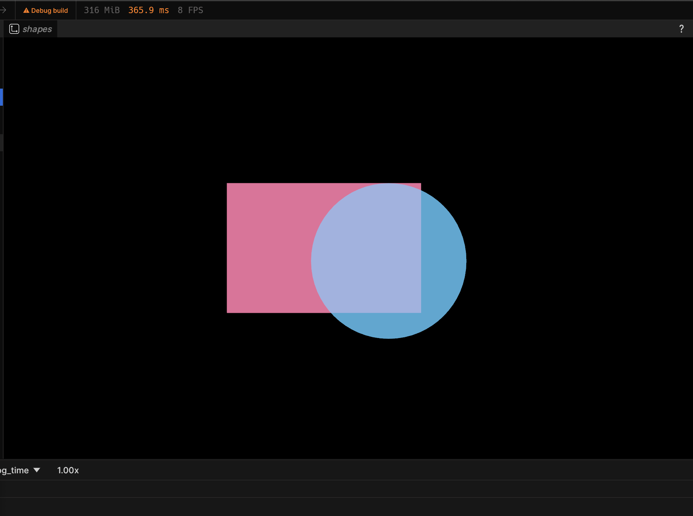
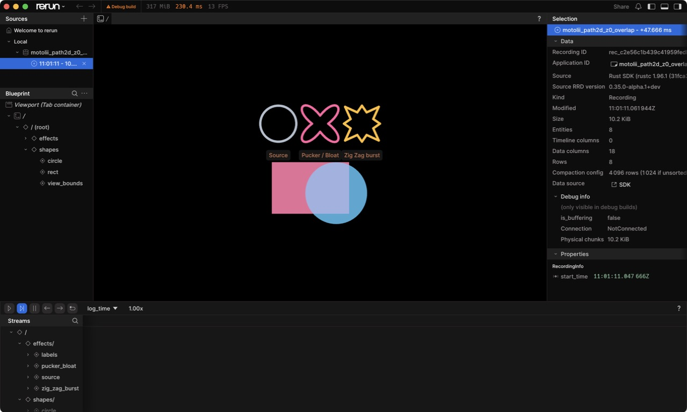
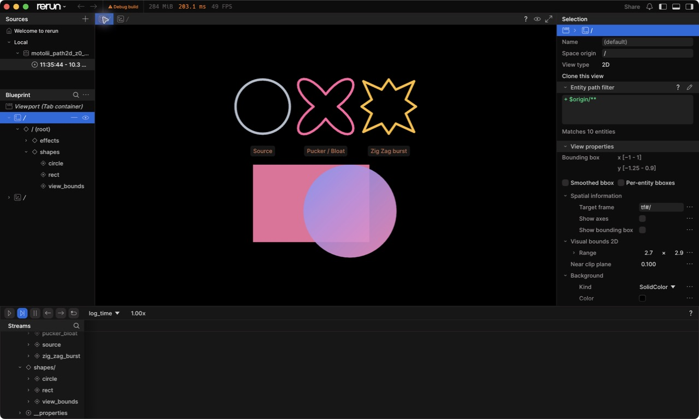

# Rerun Path2D probe

固定Rerun commit `954bf95a4e1a01de4cb67e0e92b8a5e059ee2b8e`の`Spatial2DView`へ、
Motoliiの`pathgeom::Path`を読むcustom visualizerを登録するprivate proof。

```bash
cargo test --manifest-path spikes/rerun-path2d-probe/Cargo.toml
cargo run --manifest-path spikes/rerun-path2d-probe/Cargo.toml
```

表示するのはz=0の塗りつぶしRect／Circleと、その下に並ぶSource Circle、Pucker / Bloat、
Zig Zag burstのoutline。Circleの`draw_order`が高く、fill同士はpremultiplied source-overで重なる。
outlineは既存`pathgeom::apply`のPath変形結果をRerun標準`LineStrips2D`へ渡す。
製品Document、公開Vism SDK、Rerun store、Preview／Exportの完成を意味しない。

Circle fillは正準2D平面の青→桃gradientを同じPathのraster coverageでclipする。
mask外は透明で、背面Rectとのpremultiplied source-overを維持する。一回だけ使うvector maskなので
中間mask textureを作らず、既存fragment passへ融合している。







このprobeのBlob codec、convex triangle fan、view-fit用の透明`Points2D`、shapeごとのbuffer生成は
製品採択対象ではない。次の発注境界は
[M5-PATH2D-S1](../../docs/reviews/2026-08-10-m5-path2d-rerun-custom-visualizer-probe-and-dispatch-route.md#M5-PATH2D-S1--product-Stage-seat-compile)
のRN Stage seat compileとする。
